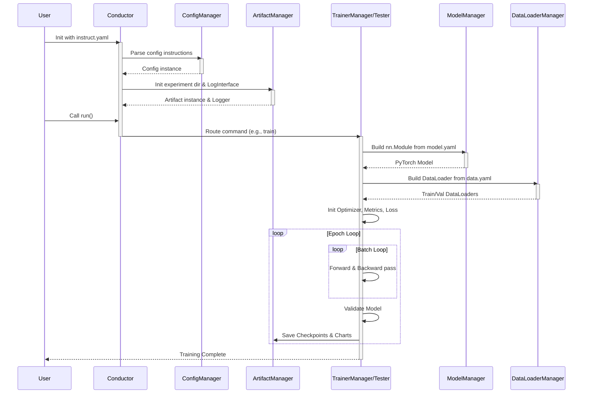

# Conductor Architecture

## 1. 总览

### 1.1 项目简介
**Conductor** 是一个基于 PyTorch 开发的、高度模块化的计算机视觉（CV）深度学习训练框架与实验调度器（Trainer）。
它的诞生初衷是为了解决传统深度学习项目中“模型结构硬编码、消融实验改动成本高、新手学习曲线陡峭”等痛点。Conductor 借鉴了类似 Ultralytics（YOLO 系列）的工程化思想，但在代码架构上进行了极大的精简与解耦，使其更加适合学术研究、自定义模型开发以及深度学习爱好者的日常实验。

### 1.2 核心能力
* **极简的实验管理**：仅需编写少量 Python 入口代码，所有的超参数、数据路径、模型结构均通过 YAML 文件进行统一管理。
* **动态模型构建 (NAS 友好)**：支持通过 YAML 列表直接拼接网络架构（如 Backbone、Head），天然支持跨层连接（Skip Connections）、特征融合（如 FPN/PAN）等复杂拓扑结构，无需修改底层的 `forward` 函数。
* **原生分布式支持**：内置对 PyTorch DDP（DistributedDataParallel）多卡分布式训练的支持。
* **开箱即用的工程组件**：集成了日志记录（Logging）、性能评估（Profiler/FLOPs 计算）、指标跟踪（Metrics）、以及灵活的权重及产物管理（Artifacts）。

### 1.3 核心机制
Conductor 的核心机制可以概括为 **“配置驱动（Configuration-Driven）”** 与 **“积木式拼装（Modular Assembly）”**：
1. **配置驱动**：框架的控制中枢（`ConfigManager`）会读取用户的指令文件（如 `instruct.yaml`）。所有的后续行为（使用什么设备、加载哪个数据集、执行训练还是测试、调用哪种优化器）全部由该配置对象下发给具体的执行类。
2. **积木式拼装**：在 `model.py` 中，网络不再是一个巨大的 Python Class，而是一个由 `[输入来源, 重复次数, 模块名称, 模块参数]` 组成的列表。系统通过反射与工厂模式（`ModuleProvider`）动态实例化对应的 `nn.Module`，并在前向传播时自动维护一个 `saved` 字典来路由跨层特征流。

### 1.4 处理流程
整个框架的生命周期呈现出清晰的线性分发与组装逻辑。以下是 Conductor 处理一次训练任务的典型控制流与数据流：



### 1.5 流程详解 (Step-by-Step Flow Explanation)

为了让整个框架的流转逻辑一目了然，我们可以结合代码对上述时序图进行逐步骤的拆解：

#### 第一步：初始化与配置解析 (Initialization)
一切都从用户的一行代码开始：
```python
from conductor import Conductor
tar = Conductor('instruct.yaml')
```
当实例化 `Conductor` 时，框架首先会读取你提供的 `instruct.yaml` 文件。这个字典被送给 **单例模式** 的 `ConfigManager`（配置大管家）。紧接着，系统会实例化 `ArtifactManager`（产物大管家，负责创建 `outputs/xxx/` 这类实验输出目录）以及 `LogInterface`（日志系统）。在这个阶段，框架搭建好了后勤环境。

#### 第二步：指令路由分发 (Command Routing)
当用户调用 `tar.run()` 时，`Conductor` 开始发挥“指挥家”的作用。它会去检查配置文件里的 `command` 字段到底写了什么。
```python
# conductor.py 节选
def run(self):
    if self.cm.command == 'train':
        orch = TrainerManager(self.cm, self.am, self.log) # 分发给训练主管
        orch.train()
    elif self.cm.command == 'test':
        orch = Tester(...) # 分发给测试主管
        orch.test()
```
此时，控制权被正式移交给对应的执行引擎（例如 `TrainerManager` 训练管理器）。

#### 第三步：装配实验资源 (Resource Assembly)
`TrainerManager` 被唤醒后，它知道自己要干活（训练），但它还需要两样东西：**模型**和**数据**。
1. **造模型**：它调用 `ModelManager`，传入 `model.yaml` 的路径。`ModelManager` 根据你的文本描述，使用 PyTorch 动态拼装出一套真实的、可以直接 `forward` 的网络架构（即 `Model` 类实例）。
2. **搞数据**：它调用 `DataLoaderManager`，传入 `data.yaml` 的路径。这个管理器负责寻找图片、解析标签，并生成 PyTorch 标准的 `train_loader` 和 `val_loader`。

#### 第四步：进入核心循环 (Execution Loop)
模型和数据都准备完毕，`TrainerManager` 会接着初始化**优化器 (Optimizer)**、**损失函数 (Criterion)** 和 **指标收集器 (MetricsManager)**。随后，它直接进入经典的 PyTorch 训练循环：
```python
for epoch in range(epochs):
    # 1. 训练阶段：Forward -> Compute Loss -> Backward -> Optimizer Step
    for batch in train_loader:
        # ...
    
    # 2. 验证阶段：在验证集上跑一遍，计算 Top-1 Acc 等指标
    self.validate()
```

#### 第五步：保存与归档 (Save & Logging)
在每个 Epoch 结束，或者达到最佳指标（Best Metrics）时，执行引擎会向后勤求助：调用 `ArtifactManager` 的方法，把当前权重视为 `last.pt`，如果是历史最佳则同时存为 `best.pt`。同时把各项 Acc、Loss 等指标绘制成图表或保存进 log 文件。训练结束后，所有东西都整整齐齐地躺在 `outputs/` 目录下。

---

## 2. 使用说明

*(待撰写：将介绍如何编写 YAML、如何启动训练、内置模型的使用、以及自定义模块的注册等)*

## 3. 架构描述

本章节将自顶向下，深入剖析 Conductor 框架的底层代码设计。我们将从宏观的调度中心开始，逐步拆解模型构建引擎与数据管道，最后深入到执行训练与评估的具体组件。这部分内容是理解框架内部运行机制、进行深度定制和二次开发的最佳参考。

### 3.1 核心控制层

核心控制层负责将用户提供的静态文本指令转化为可执行的 Python 对象与 PyTorch 计算图。它由三个最顶层的文件构成：`conductor.py` 负责流程调度，`model.py` 负责网络拓扑解析，`data.py` 负责数据流向。

#### `conductor.py` 

这是整个框架的执行入口。它不涉及具体的张量运算、损失计算或数据集遍历逻辑，只负责配置的初始化和路由分发。

* **初始化基础设施**：在实例化 `Conductor` 类时，它会读取配置文件（如 `instruct.yaml`），将其传递给单例的 `ConfigManager` 进行解析。紧接着，实例化 `ArtifactManager` 以建立实验相关的输出目录，并初始化 `LogInterface` 建立全局日志系统。
* **动态路由**：`run` 方法通过检查配置对象中的 `command` 字段来进行判断分支。如下方代码所示，它根据指令实例化对应的管理器并将控制权移交。如果未来需要新增功能，只需在此处增加新的 `elif` 分支即可。

```python
def run(self):
    if self.cm.command == 'train':
        orch = TrainerManager(self.cm, self.am, self.log)
        orch.train()
    elif self.cm.command == 'test':
        orch = Tester(self.cm, self.am, self.log)
        orch.test()
    # ... 其他分支
```

#### `model.py`

负责将网络架构描述翻译成可供 PyTorch 执行前向传播的 `nn.Module` 实例。

* **`ModelManager` 类**：统筹模型构建。为了保证向下兼容性并提供高度定制化能力，它支持解析两种输入模式：
  * **内置模式**：若配置文件中直接写明类似 `torchvision.models.resnet18` 的字符串，管理器会利用反射机制实例化预训练模型。
  * **YAML 模式**：读取自定义的拓扑结构文件，对网络层列表中的各项参数（如输入来源、模块名称、超参数）进行解析与校验。

* **`Model` 类**：当使用 YAML 模式解析时，会生成此类的实例。它打破了传统 PyTorch 模型需要将 `forward` 函数硬编码的限制。在初始化时，它根据配置列表，利用反射从组件库中实例化基础网络块，并存入 `nn.ModuleList` 中。
其核心逻辑在于 `_forward_impl` 方法。在前向传播时，它通过循环遍历模块列表。每一个模块根据配置中的 `from` 字段来决定自己的输入来源。如果 `from` 为 -1，则接收上一层的输出；如果是特定的层索引，则去局部的 `saved` 字典里提取缓存的特征图。

```python
def _forward_impl(self, x: Tensor) -> Tensor:
    saved = dict()
    for layer in self.layers:
        # 判断输入来源并执行 forward
        if layer.f != -1:
            x = layer(*(saved.get(i) for i in ([layer.f] if isinstance(layer.f, int) else layer.f)))
        else:
            x = layer(x)
            
        # 如果当前层的输出未来会被用到，存入 saved 字典缓存
        if layer.i in self.save:
            saved[layer.i] = x
    return x
```
依靠这种基于字典的动态路由与特征缓存机制，增加残差连接或跨层特征融合变得极其简便。

#### `data.py`

负责将硬盘等存储介质上的数据转化为 PyTorch 训练所需的张量流。

* **`DataLoaderManager` 类**：解析 `data.yaml` 配置，读取数据集的路径、类别信息以及任务类型。它封装了 PyTorch 的 `DataLoader`。此外，它包含了对分布式训练的适配逻辑，当 `ConfigManager` 指示启用 DDP 时，会自动为数据集包装 `DistributedSampler`，确保多张显卡之间的数据切分正确无误。
* **`ClassifyDataset` 类**：框架自带的分类任务数据集实现。为了优化数据读取瓶颈，它对 `parquet` 格式的数据表进行了专门支持。更重要的是，它内部实现了一个基于 `pickle` 的高速缓存机制（生成 `.cache` 文件）。如果索引命中缓存，则直接跳过磁盘读取，极大提升了训练初期反复读取大量小图片时的 I/O 效率。

```python
def _getitem_original_(self, index):
    if index in self.cache:
        # 命中缓存，直接返回
        img, label = self.cache[index]
    else:
        # 未命中缓存，从磁盘或 parquet 读取并写入缓存
        if self.format == 'parquet':
            img, label = self._getitem_parquet_(index)
        self.cache[index] = (img, label)
        
    img = self.trm_enhance(img)
    return img, label
```

### 3.2 执行引擎

执行引擎负责模型整个生命周期的运转，包含前向传播、反向传播、评估、可视化与性能分析等核心业务逻辑。它主要由 `test.py`, `train.py` 和 `profiler.py` 构成。为了理清它们之间的依赖关系，我们首先从测试引擎讲起。

#### `test.py`

专职负责模型在验证集或测试集上的评估，并提供丰富的可视化与分析工具，帮助研究人员深入理解模型的表现。

* **`Tester` 类**：作为测试与评估逻辑的基类，它的核心职责是在不计算梯度的前提下验证模型性能。
  * **指标与混淆矩阵**：核心评估逻辑在 `test_epoch` 方法中。它在 `torch.no_grad()` 上下文中遍历数据流，使用自定义的 `Recorder` 记录下所有的预测结果与真实标签，并基于混淆矩阵计算出每个类别的 Precision（精确率）和 Recall（召回率）。
  
  ```python
  # test_epoch 核心指标计算
  precision = Calculate.precision(self.recorder.get_conf_mat())
  recall = Calculate.recall(self.recorder.get_conf_mat())
  ```
  * **诊断工具集**：不仅限于输出准确率，`Tester` 内置了多个实用的诊断函数：
    * `latency`: 通过多次前向传播计算模型的平均推理耗时（ms）。
    * `sampling` / `focusing`: 随机采样验证集图片，或专门针对混淆矩阵中表现最差的类别进行抽取，绘制并保存“模型预测标签/真实标签”的对比图，便于排查数据集问题。
  * **可解释性 (`GradCAM` 内部类)**：通过向指定卷积层注册前向和反向传播的钩子（Hook），截获特征图和梯度，计算并输出特征热力图，直观展示模型在做决策时的注意力区域。
    虽然 `test` 方法的默认流程中没有直接调用 `GradCAM`，但框架通过 `get_cam()` 提供了一个非常便利的接口供用户在自定义脚本中进行可解释性分析。用户只需获取测试器实例并指定想要观察的网络层：
    
    ```python
    tester = Tester(cm, am, log)
    tester.model = tester.model_mng.build_model()
    
    # 实例化 GradCAM 分析器
    cam_analyzer = tester.get_cam()
    
    # 获取目标分析层，例如模型的最后一层卷积块
    # 这里的 tester.model.layers 是在 model.py 中动态构建的 ModuleList
    target_layer = tester.model.layers[-2]  
    
    # 传入需要分析的单张图片张量（需带有 batch 维度 BCHW）
    # generate_cam 会自动注册 Hook、执行前向/反向传播并返回归一化后的 numpy 热力图
    heatmap_numpy = cam_analyzer.generate_cam(input_tensor, target_layer)
    ```

#### `train.py`

封装了模型从初始化到收敛的完整训练生命周期。该模块原生支持 PyTorch DDP（DistributedDataParallel）多卡分布式训练。

* **继承机制与状态隔离**：在代码层面，`class Trainer(Tester):` 明确指出了两者的继承关系。之所以这样设计，是为了让训练器在每个 Epoch 结束时能直接复用 `test_epoch` 等验证逻辑。
  为了保证两个执行器在运行状态上不产生冲突，`Trainer` 重写了 `__init__` 方法，**且故意不调用 `super().__init__()`**。因为在多卡分布式训练下，`Trainer` 运行在多个并行的进程（对应多个 `rank`）中，它必须独立管理属于当前进程的 CUDA `device` 绑定等独占状态。通过手动在自身实例上绑定 `test_epoch` 运行所需的基础设施对象（如 `self.cm`, `self.log`, `self.device`），`Trainer` 能够安全且无缝地调用父类的方法，彻底避免了父类独立初始化可能带来的进程冲突或状态污染问题。
* **`TrainerManager` DDP 派生**：外部由 `TrainerManager` 负责统筹。若配置指示启用多卡训练，它会调用 `torch.multiprocessing.spawn` 派生出多个并行的 `Trainer` 实例。
* **`Trainer` 类核心功能**：
  * **分布式初始化**：在初始化阶段调用 `dist.init_process_group` 建立进程通信组，并将 PyTorch 原生模型包裹进 `DistributedDataParallel` 容器中。
  * **生命周期循环**：负责管理 `Optimizer`、`LR_Scheduler` 以及损失函数。在 Epoch 循环内部执行 `forward -> compute loss -> backward -> optimizer step` 的经典步骤。每一轮训练结束后，调用父类的 `test_epoch` 对验证集进行评估，最后由主进程（如 `rank 0`）负责向磁盘保存最佳的 Checkpoint 文件与训练日志图表。

#### `profiler.py`

独立的性能评估组件，用于静态测算模型的理论复杂度。

* **`Profiler` 类**：它不依赖真实数据集，而是使用 `thop` 库。它根据用户配置文件生成模型，并构造符合 `imgsz` 形状的随机张量输入。通过调用 `thop.profile`，自动测算并在日志中打印该模型的总参数量（Parameters）和在特定分辨率下的计算浮点运算数（FLOPs / GFLOPs）。这是指导轻量级模型设计不可或缺的量化指标。

### 3.3 内置模型库 (`models` 目录)

`models` 目录包含了框架自带的一系列完整的、基于传统 PyTorch 类（`nn.Module`）硬编码编写的计算机视觉模型。这些模型可以直接通过 `ModelManager` 的内置模式（`bt`）被调用。该目录主要提供经典轻量化基准网络，以及作者原创的实验性架构。

#### 经典轻量级基准网络 (Baselines)
为了方便进行性能对比和 Baseline 测试，目录中内置了业界主流的端侧轻量化模型复现：

* **`ghostnet.py` & `ghostnetv3.py`**：复现了华为诺亚方舟实验室提出的 GhostNet 系列网络。包含了其标志性的 `GhostModule`（通过廉价线性操作生成更多特征图）和 `GhostBottleneck` 结构。
* **`mobilevit.py`**：复现了苹果提出的 MobileViT。该网络巧妙地结合了 CNN 的局部感知能力与 Transformer（`MultiHeadAttention` 和 `TransformerEncoder`）的全局建模能力，是轻量级混合架构的代表。

#### 原创实验架构与魔改网络
这部分是作者探索新型算子与注意力机制的实验田，也是 `models` 目录中最具特色的部分。

* **`ach_bnc.py` (自适应交叉哈达玛积与瓶颈层)**：
  这是作者原创的 `ACH`（Adaptive Cross Hadamard）机制的核心实现文件。
  * **`AdaptiveCrossHadamard` (ACH)**：一种新型的自适应特征提取算子，其内部维护了诸如 `tau_init` 等温度系数参数，旨在通过交叉哈达玛积运算来提取更丰富的特征表达。
  * **`AdaptiveBottleneckBNC`**：这里的 `BNC` 代表了对张量形状 `(B, N, C)` 的适配层设计。因为标准的 CNN 算子通常接收 `(B, C, H, W)` 格式的图像张量，而像 MobileViT 中的 Transformer 编码器处理的是 `(B, N, C)` 格式（Batch, 序列长度 N, 通道数 C）的扁平化特征序列。`AdaptiveBottleneckBNC` 的作用就是作为桥梁，它内部调用 `ACH` 算子，并将输入/输出的张量形状进行了灵活的维度转换和对齐（例如在内部转换为 `(B, C, N, 1)` 交由 CNN 处理后再转换回 `(B, N, C)`），使其能够无缝嵌入到 Transformer 块或类似序列处理的网络结构中。

* **`mobilevit_ach.py`**：
  这是作者基于标准的 `mobilevit.py` 源码进行的深度魔改版本。它通过引入 `ach_bnc.py` 中定义的 `AdaptiveBottleneckBNC`，将原创的 `ACH` 机制完美融合进了 MobileViT 的块结构中，从而衍生出了一个带有自定义特征提取机制的新型混合视觉模型。

### 3.4 动态积木组件 (`modules` 目录)

这是 Conductor 框架实现“动态组装”的核心引擎，也是作者进行新型算子消融实验的兵工厂。这里存放的是高度解耦的、可以直接被 YAML 配置文件动态实例化的网络层组件。

#### `_utils.py` 与 `module.py` (组件基石与注册中心)
这两个文件构成了整个动态机制的底层逻辑抽象。
* **`BaseModule`**：所有的动态积木必须继承该基类。它强制要求子类实现静态方法 `yaml_args_parser`。这是一个“参数解包器”，它负责将 YAML 中粗糙的列表（如 `[16, 3, 2]`）翻译为当前 `__init__` 函数所需的详细参数（输入通道、输出通道、步长等）。
* **`TensorCollector`**：这是一个极具工程巧思的调试工具类。在构建复杂网络（如特征金字塔或注意力机制）时，往往需要提取中间层的特征张量。通过调用 `TensorCollector.collect(x, 'key')`，可以在不打断 `forward` 返回值结构的前提下，将深层张量旁路收集到一个全局字典中，极大地方便了后续的热力图生成与张量可视化诊断。
* **`ModuleProvider`**：作为全局组件的静态注册中心，它维护了一个将字符串名称（如 `"HadamardResidual"`）映射到实际 Python 类的字典字典，使得 `model.py` 能够通过纯文本配置完成反射调用。

#### `block.py` (核心特征提取块)
这里不仅复现了业界主流的轻量级骨干，更集中展示了作者在模型轻量化与特征交叉计算上的原创实验。
* **传统轻量网络骨架**：包含了标准的 `InvertedResidual`（MobileNet V2/V3 倒残差块）和 `GhostModule`（廉价特征生成模块）。
* **原创 `HadamardResidual` 系列**：这是本目录的精髓之一。
  * 在传统的倒残差块中，通常使用 1x1 卷积进行通道升维（Expansion）。而在这里，作者设计了 `HadamardExpansion`，尝试利用通道间的哈达玛积（Hadamard Product）取代昂贵的 1x1 卷积来生成扩展特征，以极低的参数量换取特征容量。
  * 其演进版本 `HadamardResidualV2` 则进一步引入了 `AdaptiveCrossHadamard` 算子，通过引入可学习的温度系数和动态门控机制，探索自适应的交叉维度特征表达。

#### `nas.py` (可微架构搜索系统)
该文件为框架原生注入了 DARTS (Differentiable Architecture Search) 风格的可微架构搜索能力。
* **`SearchableModule`**：这是一个搜索容器。在构建时，它可以接收多个备选算子（如 3x3 卷积、5x5 卷积、或 `SearchableBlank` 占位符）。在 `forward` 时，它会利用 `F.gumbel_softmax` 对内部维护的架构参数 `nas_alpha` 进行归一化，并将所有备选算子的输出按权重相加融合。
* **`TauScheduler`**：配合 Gumbel-Softmax 使用的温度系数退火调度器。它支持 `cos`（余弦）、`linear` 等多种退火策略。在训练初期使用高温度（软化分布）鼓励广泛探索各个算子分支；随着 Epoch 增加，温度逐渐降低，Gumbel 分布逼近 argmax，使得网络结构最终平滑地收敛收缩为一个确定的离散架构。

#### `misc.py` (实验性细粒度算子库)
作为一个杂项零件库，这里堆放了作者构思的大量微型算子，它们通常作为子组件被镶嵌到 `block.py` 中。
* **动态激活/代数簇 (`Dy` 系列)**：包含 `DySoft`, `DySig`, `DyT` (Dynamic Tanh) 等。它们不再使用固定的非线性函数，而是将缩放系数、偏置甚至函数形态本身作为可学习参数，以期让网络自行拟合出最适合当前数据分布的激活面。
* *[实验标记]*：诸如 `CrossHadaNorm` (目前在 V2 残差块中被注释废弃) 以及 `conv.py` 中的 `RepConv` (重参数化卷积雏形)、`MeanFilter`，这些组件并未在主干网络中被大规模调用，而是作为作者思维实验的“中间草稿”被保留，体现了该框架强烈的学术沙盒属性。

#### `cuda_modules` (突破显存瓶颈的底层引擎)
这是一个至关重要的 C++/CUDA 原生算子扩展库。
* **为何必须存在**：无论是 `nas.py` 里的多分支 Gumbel 融合计算，还是 `block.py` 里的 `AdaptiveCrossHadamard` (ACH) 和 `DySoft`，这些复杂的动态算子如果完全依靠 PyTorch 的 Python API（如高维度的 `.view()`, `.expand()` 或多次循环乘法）来组装计算图，在反向传播（Backward）时会生成极其庞大且冗余的显存分配树，导致严重的显存爆炸与计算卡顿。
* **底层 Kernel 融合**：为了让这些优美的算法构想能够在消费级显卡上真正跑起来，作者深入底层，使用 CUDA C++（如 `cross_hada.cu`, `dysoft.cu`）手工编写了前向与反向传播的 Kernel 代码，将繁杂的细粒度操作进行了“算子融合 (Kernel Fusion)”。最后借助 PyTorch 的 `cpp_extension` 机制编译为 `cdt_extensions.so`。这使得框架中的原创动态算子获得了媲美官方原生算子的极致性能与低显存占用。

### 3.5 基础设施库 (`utils` 目录)

`utils` 目录虽然位于最内层，但它构成了整个 Conductor 框架的“神经系统”与“后勤保障”。没有它们，动态模型组装和分布式训练都将无法运行。我们将它们划分为三大子系统：配置与资源管理、终端交互、以及指标统计与可视化。

#### `back.py` (配置与产物管理)
该文件提供了两个在框架生命周期中起到全局支撑作用的类。

* **`ConfigManager` (配置解析与对象反射)**
  这是整个框架的全局大管家，在生命周期初次被实例化后，它的引用会被传递到所有的 Manager 中。
  * **单例模式设计**：通过 `get_instance` 方法，保证了无论系统嵌套多深，在任何地方获取到的配置对象都是同一个实例，避免了参数不一致。
  * **字符串反射实例化**：它不仅仅是简单地存储 YAML 中的键值对，更核心的功能是将配置文件中配置的字符串类名，利用反射动态实例化为 PyTorch 的实体对象。例如，如果你在 `instruct.yaml` 中配置 `optimizer: AdamW`，`ConfigManager` 内部的 `get_optimizer` 方法就会利用 `getattr(optim, self.cm.optimizer)` 找到真实的 `torch.optim.AdamW` 类，并为你装配好学习率和权重衰减等超参数。同理，对于 `criterion`（损失函数）和 `scheduler`（学习率调度器）也是如此。

* **`ArtifactManager` (实验产物存储系统)**
  每一次 `run` 的执行，都伴随着大量的中间产物（权重文件、日志文本、图片）。`ArtifactManager` 负责接管所有的文件 I/O 行为。
  * **目录沙盒化**：在初始化时，它会自动在 `output_dir` 下创建一个形如 `exp_xxx` 或时间戳命名的新文件夹作为沙盒（`taskdir`）。
  * **路径统一定义**：在它的 `__init__` 中，定义了所有可能用到的标准化路径，例如：
  
  ```python
  self.console_logger_path = self.taskdir / 'console.log'
  self.metrics_logger_path = self.taskdir / 'metrics.csv'
  self.weights_dir = self.taskdir / 'weights'
  self.best = self.weights_dir / 'best.pt'
  self.last = self.weights_dir / 'last.pt'
  ```
  不仅如此，它还封装了诸如 `plot_samples`（将采样图片拼接保存）等操作。当外部组件（如 `Tester`）需要保存东西时，只需调用它的接口，而无需关心具体存到哪里的硬盘路径。

#### `front.py` (终端与日志交互)
* **`LogInterface`**
  该类封装了所有的控制台打印操作，统一了终端的输出风格并实现了本地化存档。
  * **日志双写 (Dual-Write)**：它的核心方法是 `info`。当外部调用 `self.log.info("msg")` 时，它不仅会通过 `print` 输出到控制台，还会立刻调用 `self.am.info` 将其追加到 `console.log` 文件中。这样保证了实验结束后的复盘有迹可循。
  * **格式化指标输出**：`metrics(met: dict)` 方法专门用来处理测试和训练指标。它能够自动根据 value 的类型（int, float, time）将其右对齐并限制小数位数，最终呈现出像表格一样极其整齐的控制台输出，并将格式化后的数据同步保存到 `.csv` 文件中。
  * **进度条封装**：为了防止原生的 `tqdm` 进度条与多进程 DDP 的输出打架，它封装了 `bar_init`, `bar_update`, 和 `bar_close`，集中管理控制台渲染状态。

#### `stat.py` 与 `plot.py` (指标统计与可视化图表)
模型好不好，全靠这两个文件来算。

* **`stat.py`** (统计中心)：
  * **`Calculate` (静态计算类)**：将与纯张量计算相关的指标剥离了出来。它包含了如 `topk_accuracy` 等通用算法。特别地，它提供了基于混淆矩阵（Confusion Matrix）的计算方法，例如 `precision(conf_mat)` 和 `recall(conf_mat)`，这是应对类别不平衡数据集时比纯 Acc 更有价值的评价手段。
  * **`Recorder` (指标暂存器)**：设计非常巧妙，用在每一个 Epoch 内部。它在内部维护了一个存储预测与标签对应关系的局部混淆矩阵（`self.conf_mat`），并且接收每一个 batch 产生的 loss。当 Epoch 结束时，调用 `converge()`，它会一次性求出该轮的平均 loss 和 Top-1 准确率。
  * **`MetricsManager` (全局生命周期指标树)**：用来长期存储每一个 Epoch 跑完后的历史数据。为了支持除了分类以外的任务，它设计了一个基础的 `Metrics` 数据类，并派生出了 `ClassifyMetrics` 和 `DetectMetrics`。这使得在同一个列表中，可以干净地存放多轮迭代的结构化评估结果。

* **`plot.py`** (`Plot` 类)：
  紧密配合 `MetricsManager` 工作。在每一个 Epoch 保存模型后，它会提取 `MetricsManager` 中积累的历史数据序列（例如第 1 轮到第 N 轮的 `val_loss` 和 `top1_acc`），并调用 `matplotlib` 绘制出平滑的折线图。最终生成直观的趋势图表交由 `ArtifactManager` 存入磁盘。这对于判断模型是否过拟合、学习率设置是否合理，起到了决定性的帮助。

这是 Conductor 框架真正的“动力核心”与“魔改兵工厂”。与 `models` 目录下写死的完整网络不同，这里存放的是高度解耦的、可以直接被 YAML 配置文件动态调用的网络层组件（Legos）。

#### `_utils.py` 与 `module.py` (基础设施)
这两个文件构成了动态模型组装的底层逻辑。
* **`BaseModule` (`_utils.py`)**：所有可被 YAML 调用的组件必须继承此基类。它强制要求子类实现静态方法 `yaml_args_parser`。这个方法就如同一个“翻译官”，它的作用是告诉解析引擎：当在 YAML 中遇到像 `[16, 3, 2]` 这样的参数列表时，应该如何把它解包并传递给当前类的 `__init__` 函数。
* **`ModuleProvider` (`module.py`)**：这是一个静态的组件注册中心。它维护了一个字典 `_modules`，将字符串名称（如 `"ConvNormAct"`）映射到真实的 Python 类。这让框架拥有了反射调用的能力。

#### `conv.py` 与 `head.py` (基础组件)
* **`conv.py`**：封装了最基础的卷积单元。其中最常用的是 `ConvNormAct`（融合了卷积、归一化和激活函数）。
  * *[注] 实验遗留*：文件中存在如 `RepConv`（重参数化卷积雏形）和 `MeanFilter`（均值滤波）等类，但目前并未在主要网络中被广泛调用，推测为作者为了某些实验临时预留的算子。
* **`head.py`**：提供了常规的分类任务输出头，如 `Classifier`（带隐藏层的输出头）和 `ClassifierSimple`（基于自适应平均池化的极简线性分类头）。

#### `block.py` 与 `misc.py` (核心特征提取块与杂项机制)
这里集中展示了轻量级网络设计的巧思以及作者原创的特征提取机制。
* **经典轻量块复现**：包含了 MobileNet 系列的 `InvertedResidual`（倒残差块）以及类似 GhostNet 思想的 `GhostModule` 等。
* **原创算子组合**：包含了大量作者进行消融实验的原创组件。例如 `HadamardResidual`（哈达玛残差块）、`AdaptiveBottleneck`（自适应瓶颈层）等。
* **`misc.py`**：作为辅助零件库，它存放了颗粒度更小的算子或注意力机制，例如 `ECA`（通道注意力模块）、`RMSNorm` 以及一堆以 `Dy` 开头的动态激活/代数算子（`DySoft`, `DySig`, `DyAlge`, `DyT` 等）。这些小零件会被灵活组装进 `block.py` 中的大模块里。
  * *[注] 实验搁置*：`misc.py` 中还有一个 `CrossHadaNorm` 类，目前在 `block.py` 中被注释掉了（`# self.norm = CrossHadaNorm(self.cs_expand)`），表明这曾是一个实验性的归一化方案，目前可能处于废弃状态。

#### `nas.py` (可微分架构搜索支持)
该文件为框架提供了 NAS（Neural Architecture Search）能力。
* **`SearchableConvNormAct` / `SearchableModule`**：这些是可以包含多个候选算子路径（如不同大小的 kernel size）的搜索空间组件。
* **`TauScheduler`**：针对 Gumbel-Softmax 等可微搜索算法设计的温度系数（Tau）退火调度器。它支持多种退火策略（linear, exp, cos 等），帮助网络在训练初期广泛探索，在后期逐渐收敛到一个确定的离散架构。

#### `cuda_modules` 子目录 (底层性能引擎)
这是一个极具含金量的 C++/CUDA 原生算子扩展库。
* **存在意义**：作者在 `misc.py` 和 `block.py` 中设计了诸如 `AdaptiveCrossHadamard` (ACH) 和动态算子 `DySoft`。如果仅仅使用 PyTorch 的高级 API（如多重切片、乘法组合）来实现这些复杂的张量交叉操作，会导致反向传播时生成海量的中间计算图节点，造成严重的显存膨胀和计算速度拖累。
* **实现方式**：为了跨越这个工业落地的瓶颈，作者使用底层的 CUDA C++（如 `cross_hada.cu` 和 `dysoft.cu`）手工编写了前向与反向的并行计算 Kernel，并通过 `setup.py`（借助 `cpp_extension` 和 `pybind11`）编译为了名为 `cdt_extensions` 的动态链接库供 Python 高效调用。这体现了框架从“算法构思”到“底层性能优化”的完整实验闭环能力。