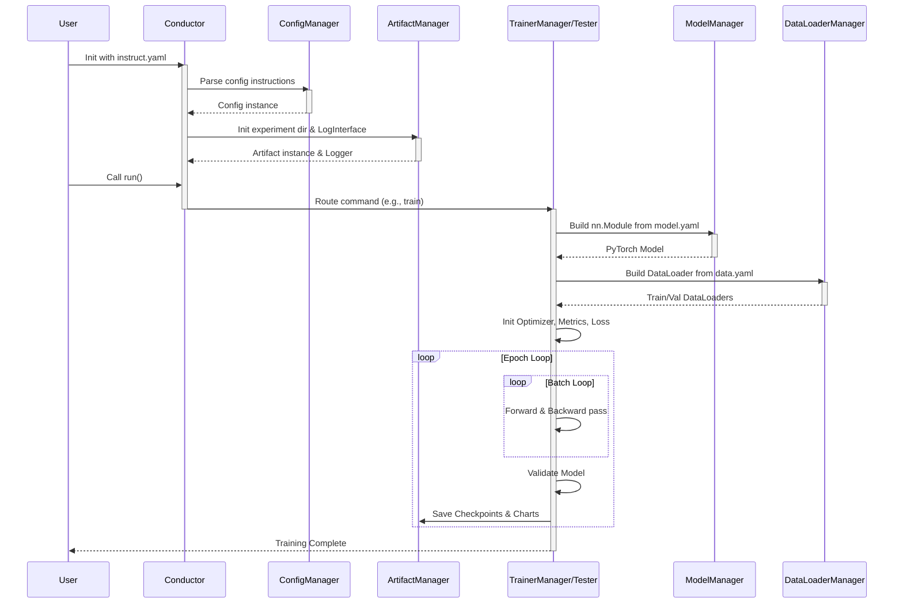

# Conductor Architecture

## 1. 总览

### 1.1 项目简介
**Conductor** 是一个基于 PyTorch 开发的、高度模块化的计算机视觉（CV）深度学习训练框架与实验调度器（Trainer）。
它的诞生初衷是为了解决传统深度学习项目中“模型结构硬编码、消融实验改动成本高、新手学习曲线陡峭”等痛点。Conductor 借鉴了类似 Ultralytics（YOLO 系列）的工程化思想，但在代码架构上进行了极大的精简与解耦，使其更加适合学术研究、自定义模型开发以及深度学习爱好者的日常实验。

### 1.2 核心能力
* **极简的实验管理**：仅需编写少量 Python 入口代码，所有的超参数、数据路径、模型结构均通过 YAML 文件进行统一管理。
* **动态模型构建 (NAS 友好)**：支持通过 YAML 列表直接拼接网络架构（如 Backbone、Head），天然支持跨层连接（Skip Connections）、特征融合（如 FPN/PAN）等复杂拓扑结构，无需修改底层的 `forward` 函数。
* **原生分布式支持**：内置对 PyTorch DDP（DistributedDataParallel）多卡分布式训练的支持。
* **开箱即用的工程组件**：集成了日志记录（Logging）、性能评估（Profiler/FLOPs 计算）、指标跟踪（Metrics）、以及灵活的权重及产物管理（Artifacts）。

### 1.3 核心机制
Conductor 的核心机制可以概括为 **“配置驱动（Configuration-Driven）”** 与 **“积木式拼装（Modular Assembly）”**：
1. **配置驱动**：框架的控制中枢（`ConfigManager`）会读取用户的指令文件（如 `instruct.yaml`）。所有的后续行为（使用什么设备、加载哪个数据集、执行训练还是测试、调用哪种优化器）全部由该配置对象下发给具体的执行类。
2. **积木式拼装**：在 `model.py` 中，网络不再是一个巨大的 Python Class，而是一个由 `[输入来源, 重复次数, 模块名称, 模块参数]` 组成的列表。系统通过反射与工厂模式（`ModuleProvider`）动态实例化对应的 `nn.Module`，并在前向传播时自动维护一个 `saved` 字典来路由跨层特征流。

### 1.4 处理流程
框架的执行生命周期遵循明确的配置分发与资源组装逻辑。以下是 Conductor 处理一次训练任务的典型控制流与数据流：



### 1.5 流程详解

为了让整个框架的流转逻辑一目了然，我们可以结合代码对上述时序图进行逐步骤的拆解：

**第一步：初始化与配置解析**

实例化入口：
```python
from conductor import Conductor
tar = Conductor('instruct.yaml')
```
当实例化 `Conductor` 时，框架首先会读取提供的 `instruct.yaml` 文件。配置字典由 `ConfigManager` 解析，随后实例化 `ArtifactManager` 与 `LogInterface` 完成运行环境的初始化。

**第二步：指令路由分发**

当调用 `tar.run()` 时，`Conductor` 的 `run()` 方法会根据配置字典中的 `command` 字段进行任务路由。
```python
# conductor.py 节选
def run(self):
    if self.cm.command == 'train':
        orch = TrainerManager(self.cm, self.am, self.log)
        orch.train()
    elif self.cm.command == 'test':
        orch = Tester(...)
        orch.test()
```
此时，控制权被正式移交给对应的执行引擎（例如 `TrainerManager` 训练管理器）。

**第三步：装配实验资源**

`TrainerManager` 被唤醒后，它会初始化训练所需的两大核心资源：
1. **模型构建**：它调用 `ModelManager`，传入 `model.yaml` 的路径。`ModelManager` 根据文本描述，使用 PyTorch 动态拼装出一套真实的、可以直接 `forward` 的网络架构（即 `Model` 类实例）。
2. **数据管道初始化**：它调用 `DataLoaderManager`，传入 `data.yaml` 的路径。该管理器负责解析数据集路径与标签，并生成 PyTorch 标准的 `train_loader` 和 `val_loader`。

**第四步：进入核心循环**

模型和数据都准备完毕，`TrainerManager` 会接着初始化优化器、损失函数和指标收集器（MetricsManager）。随后，它直接进入经典的 PyTorch 训练循环：
```python
for epoch in range(epochs):
    # 1. 训练阶段：Forward -> Compute Loss -> Backward -> Optimizer Step
    for batch in train_loader:
        # ...
    
    # 2. 验证阶段：在验证集上跑一遍，计算 Top-1 Acc 等指标
    self.validate()
```

**第五步：保存与归档**

在每个 Epoch 结束，或者达到最佳指标时，执行引擎调用 `ArtifactManager` 存储模型权重，把当前权重视为 `last.pt`，如果是历史最佳则同时存为 `best.pt`。各项评估指标绘制成的图表及日志文件等实验产物均归档至 `outputs/` 目录下。

---

## 2. 使用说明

### 2.1 环境配置与前提准备
为确保 Conductor 框架以及底层的算子优化正常运行，你需要先配置好运行环境并编译底层 C++ 算子。为方便配置，项目根目录下提供了 `install.sh` 脚本。

请确保你的系统中已经安装了 Python 3 和对应当前硬件环境的 PyTorch（需自带配套的 CUDA 工具链与 `nvcc` 编译器），然后在项目根目录下运行：

```bash
bash install.sh
```

该脚本将自动执行以下操作：
1. 读取并安装 `requirements.txt` 中指定的依赖环境（并补全运行时所需的基础环境包）。
2. 自动进入 `modules/cuda_modules` 目录编译 C++/CUDA 原生算子。框架的核心（如动态激活函数 `DySoft` 和交叉哈达玛算子 `AdaptiveCrossHadamard`）强依赖此扩展以释放极低的显存开销。

当终端提示安装与编译成功后，框架便具备了全量运行条件。

### 2.2 启动你的第一次训练 (快速开始)
Conductor 的核心理念是“配置驱动”。无需编写复杂的训练循环，你只需要准备两个基础 YAML 文件，并用 3 行 Python 代码即可启动训练。

**步骤 1：准备数据配置 (`data.yaml`)**
首先，告诉框架你的数据集在哪。请在资源目录下创建或修改标准的数据集配置文件（例如直接使用内置示例：`utils/resources/dataset_example/cifar100.yaml`）。

现代的 `data.py` 解析器支持树状嵌套结构，并且能够通过文件后缀（如 `.parquet`）自动推断读取模式。配置样例如下：
```yaml
task: classify
path: ./dataset            # 数据集根目录
train: 
  path: train.parquet      # 训练集相对路径
  mean: [0.507, 0.486, 0.440]  # RGB均值
  std: [0.210, 0.208, 0.215]   # RGB方差
test: 
  path: test.parquet       # 测试集相对路径
  mean: [0.508, 0.487, 0.441]
  std: [0.211, 0.209, 0.216]

names:
  0: apple
  1: aquarium_fish
  # ... 类别映射表
```

**步骤 2：撰写执行指令 (`instruct.yaml`)**
这个文件是实验的总调度器，它将所有的资源和超参数串联起来：
```yaml
# 资源绑定
model_yaml_path: utils/resources/example/mobilenetv4_s.yaml # 模型路径。除了直接指向 YAML 文件，你还可以通过特殊字符串直接调用官方内置模型（见下方说明）。
data_yaml_path: data.yaml 
output_dir: ./outputs # 实验产生的日志与权重存放的沙盒目录

# 核心指令
command: train   # 告诉框架这次要执行训练任务
task: classify   # 务必与数据配置对齐

# 超参数
epochs: 50
batch_size: 128
device: cuda
world: [0]       # 分布式卡号。写 [0] 为单卡；写 [0, 1] 即可无缝开启 DDP 双卡训练
criterion: CrossEntropyLoss
optimizer: AdamW
scheduler: CosineAnnealingLR
learn_rate: 0.001
decay: 0.0001
best_metrics: top1_acc # 模型保存的验证基准
```

> **补充：如何一键调用内置模型？**
> `model_yaml_path` 不仅支持填入 YAML 文件路径，还支持强大的字符串反射机制。如果你想直接使用 `torchvision` 中的经典网络，或者框架 `models/` 目录下预置的 Python 模型（如 MobileViT），可以直接填入 `<模型名>,<参数字典>` 格式的字符串。
> 
> 例如：
> * `model_yaml_path: shufflenet_v2_x1_0,{'num_classes':100}`
> * `model_yaml_path: mobilevit,{'num_classes':100,'mode':'xx_small'}`
> 
> *注意：使用此模式时，由于系统无法从 YAML 文件中推断任务类型，所以 `instruct.yaml` 里的 `task: classify` 字段必须显式声明，且参数字典中必须带有 `num_classes` 键。*

**步骤 3：启动任务**
在项目的任意合法调用目录下创建一个 `main.py` 脚本，将调度指令文件传给 `Conductor` 并运行：
```python
from conductor import Conductor

# 实例化指挥家并指明配置文件路径
tar = Conductor('instruct.yaml')
# 一键启动训练生命周期
tar.run()
```
执行完毕后，所有的历史折线图 (`result.png`)、进度日志 (`metrics.csv`) 以及最优的模型权重 (`weights/best.pt`) 都会整整齐齐地收录在 `outputs/task_0/` 目录下。

### 2.3 进阶一：用 YAML “搭积木”写网络
Conductor 最具魅力的特性是：**你不需要在 Python 中编写传统的 `forward` 函数**。所有的网络拓扑、跨层连接（Skip Connections）都在 YAML 文件中以列表的形式定义。

#### 核心语法解析：`[f, n, m, args]`
在 `model.yaml` 的 `backbone` 或 `head` 列表中，每一行代表一个网络层模块。它的标准格式是一个包含四个元素的列表：
* **`f` (from, 输入来源)**：
  * `-1`：默认值，代表接收上一层的输出作为当前层的输入（经典的串行结构）。
  * `整数`（如 `2`）：代表跨层接收第 2 层（网络层索引从 0 开始）的输出结果。
  * `列表`（如 `[-1, 2]`）：代表同时接收上一层和第 2 层的输出（常用于多分支特征融合算子）。
* **`n` (number, 重复次数)**：该模块需要连续重复实例化的次数（若大于 1，框架会自动将其包裹进 `nn.Sequential` 中）。
* **`m` (module, 模块类名)**：对应的网络组件名称，必须与 `modules/` 目录下（或 PyTorch 原生 `nn` 中）定义的类名一致。例如基础卷积 `ConvNormAct`、分类头 `Classifier`。
* **`args` (arguments, 模块参数)**：传递给该模块初始化函数的具体参数列表。通常遵循 `[输出通道数, 卷积核大小, 步长...]` 的规律，具体需参考对应类的 `yaml_args_parser` 方法。

#### 极简实战样例
以下是一个带有残差块和基础分类头的自定义轻量级网络配置样例。你可以直接将其保存为 `custom_model.yaml` 并在 `instruct.yaml` 中将 `model_yaml_path` 指向它：

```yaml
nc: 100 # 类别数
task: classify

# [from, repeats, module, args]
backbone:
  # 0层: 初始卷积 (输入 RGB 3通道，输出 16 通道，3x3核，步长 2 下采样)
  - [-1, 1, ConvNormAct, [[16, 3, 2], BatchNorm2d, ReLU]] 
  
  # 1层: 倒残差块 (输出 24 通道，中间扩展通道 72，3x3核，步长 2)
  - [-1, 1, InvertedResidual, [24, 72, 3, 2, 1, false, ReLU]] 
  
  # 2层: 继续堆叠一个倒残差块
  - [-1, 1, InvertedResidual, [40, 96, 5, 2, 1, true, Hardswish]]
  
  # 3层: 末端通过 1x1 卷积升维到 576 通道
  - [-1, 1, ConvNormAct, [[576, 1, 1], BatchNorm2d, Hardswish]]

head:
  # 4层: 分类头。接收第 3 层的特征图，输出 100 个类别，隐层通道 1024，Dropout 率 0.3
  - [-1, 1, Classifier, [100, 1024, 0.3]]
```

### 2.4 进阶二：测试、诊断与算力评估
除了标准的模型训练，Conductor 还内置了一键式的模型评估与算力分析工具。只需修改 `instruct.yaml` 中的 `command` 字段即可切换工作模式。

#### 1. 模型测试与诊断 (`command: test`)
当你需要评估一个已训练好的模型时：
1. 在 `instruct.yaml` 中设置 `command: test`。
2. 务必配置 `ckpt: outputs/task_0/weights/best.pt`，指明你要测试的权重文件路径。
3. 运行 `main.py`。

在测试模式下，除了会在终端打印最终的混淆矩阵与 Precision/Recall 等指标外，框架还会自动在输出目录下生成：
* **`sample.png`**：从验证集中随机采样的图像网格，并在图片下方标注 Ground Truth 与 Model Prediction 的对比，直观展示模型的预测表现。
* **`focus.png`**：专门针对混淆矩阵中表现最差的类别（识别率最低）进行针对性采样生成的诊断拼图。这有助于研究者快速定位数据集中的“困难样本”或标注错误。

#### 2. 算力评估 (`command: profile`)
在进行轻量化网络设计时，严格的计算量评估是必不可少的。
1. 在 `instruct.yaml` 中设置 `command: profile`。
2. （可选）如果你只想评估基础模型而不需要加载特定权重，可以将 `ckpt` 设为 `null`。
3. 运行 `main.py`。

在 Profiler 模式下，框架将不依赖真实数据集，而是使用虚拟张量执行前向传播。它会自动打印出该网络拓扑在当前输入分辨率下的：
* **Total Parameters**：模型总参数量。
* **MACs / FLOPs**：乘加累积操作数 / 浮点运算次数。
同时，它还会将模型图导出为 `.onnx` 格式保存至输出目录，方便你导入 Netron 等第三方工具查看计算图节点。

### 2.5 进阶三：开启可微架构搜索 (NAS)
Conductor 原生支持基于 GDAS 的可微架构搜索（NAS）。该功能允许构建复杂的搜索空间，模型能够根据训练数据和梯度反馈，在不同的特征提取模块（如 Ghost 或 ACH）之间，乃至网络深度上自动进行结构寻优。

**步骤 1：在 `instruct.yaml` 中配置双优化器**
架构搜索需要双优化器交替更新。**注意：架构参数（NAS）的学习率通常应远小于网络权重的学习率，以保证搜索的稳定**。在指令文件中增加 `nas` 配置块：
```yaml
# 网络权重的主优化器
optimizer: AdamW
learn_rate: 0.003
# ... 其他基础配置不变 ...

# 架构参数的专属优化器
nas:
  optimizer: AdamW
  learn_rate: 3e-4   # 建议比主学习率低一个数量级
  max_tau: 4.0       # 搜索初期 Gumbel-Softmax 的温度，越大探索越均匀
  min_tau: 0.1       # 搜索末期的温度，越小越逼近单一确定结构
  annealing: cos     # 采用余弦退火
```

**步骤 2：在 `model.yaml` 中定义搜索空间**
框架提供了灵活的 `Searchable` 容器。根据寻优层级的不同，你可以选用以下四个核心模块之一：

1. **`SearchableBlank` (网络深度优化)**：
   * 这是一个占位符，执行恒等映射（即跳过该层）。
   * **参数格式**：`[输出通道数]`。注意：它的输入和输出通道数必须相等。
   * **示例**：`- [-1, 1, SearchableBlank, [64]]`。

2. **`SearchableModule` (原生模块搜索)**：
   * 允许在标准的 PyTorch 模块之间进行搜索。该模块**不会**递归解析内部的 YAML 参数，因此要求你在构建 YAML 时手动补全每个候选模块的所有初始化参数。
   * **参数格式**：`[输出通道数, [模块1名称, [参数列表1]], [模块2名称, [参数列表2]], ...]`。
   * **示例**：`- [-1, 1, SearchableModule, [32, [nn.Conv2d, [16, 32, 3, 1, 1]], [nn.Conv2d, [16, 32, 5, 1, 2]]]]`。

3. **`SearchableBaseModule` (自定义大模块搜索 - 最常用)**：
   * 用于对框架内置的、继承自 `BaseModule` 的自定义复杂模块（如 `AdaptiveBottleneck`、`GhostModule`）进行宏观寻优。它会递归调用子模块自身的 `yaml_args_parser` 进行安全解析，并支持嵌套序列化。
   * **参数格式**：与 `SearchableModule` 一致，但其内部候选列表中的第一个参数必须是正确的输出通道数 `c2`。
   * **示例**：
     ```yaml
     - [-1, 1, SearchableBaseModule, [64, 
         # 候选 1：使用 Ghost 特征块
         [AdaptiveBottleneck, [64, Ghost, 2.0, 3, 1]],
         # 候选 2：使用自适应哈达玛算子
         [AdaptiveBottleneck, [64, Hada, 16, 3, 1, "DySoft"]],
         # 候选 3：占位映射。等同于跳过当前层，网络自动变浅
         [SearchableBlank, [64]],
       ]]
     ```

4. **`SearchableConvNormAct` (微观卷积核搜索)**：
   * 这是一个为了性能妥协的特化版本。它专精于在不同尺寸的卷积核之间进行搜索，并将 `BatchNorm` 和激活函数剥离出搜索空间作为共享后处理，以节省显存。
   * **参数格式**：`[[输出通道数, [候选卷积核尺寸列表], 步长, ...], 归一化层, 激活函数]`。
   * **示例**：`- [-1, 1, SearchableConvNormAct, [[32, [2, 3, 5], 2], BatchNorm2d, null]]` （在 2x2, 3x3, 5x5 的卷积核中寻优）。

按照此配置运行 `command: train` 即可进入交替搜索的 NAS Epoch。在搜索阶段收敛后，调用模型的 `get_optimal()` 方法即可对搜索空间进行离散化（`argmax`），导出最终确定的静态 PyTorch 模型配置。

---

## 3. 架构描述

本章节将自顶向下，深入剖析 Conductor 框架的底层代码设计。我们将从宏观的调度中心开始，逐步拆解模型构建引擎与数据管道，最后深入到执行训练与评估的具体组件。这部分内容是理解框架内部运行机制、进行深度定制和二次开发的最佳参考。

### 3.1 核心控制层

核心控制层负责将用户提供的静态文本指令转化为可执行的 Python 对象与 PyTorch 计算图。它由三个最顶层的文件构成：`conductor.py` 负责流程调度，`model.py` 负责网络拓扑解析，`data.py` 负责数据流向。

#### `conductor.py` 

这是整个框架的执行入口。它不涉及具体的张量运算、损失计算或数据集遍历逻辑，只负责配置的初始化和路由分发。

* **初始化基础设施**：在实例化 `Conductor` 类时，它会读取配置文件（如 `instruct.yaml`），将其传递给单例的 `ConfigManager` 进行解析。紧接着，实例化 `ArtifactManager` 以建立实验相关的输出目录，并初始化 `LogInterface` 建立全局日志系统。
* **动态路由**：`run` 方法通过检查配置对象中的 `command` 字段来进行判断分支。如下方代码所示，它根据指令实例化对应的管理器并将控制权移交。如果未来需要新增功能，只需在此处增加新的 `elif` 分支即可。

```python
def run(self):
    if self.cm.command == 'train':
        orch = TrainerManager(self.cm, self.am, self.log)
        orch.train()
    elif self.cm.command == 'test':
        orch = Tester(self.cm, self.am, self.log)
        orch.test()
    # ... 其他分支
```

#### `model.py`

负责将网络架构描述翻译成可供 PyTorch 执行前向传播的 `nn.Module` 实例。

* **`ModelManager` 类**：统筹模型构建。为了保证向下兼容性并提供高度定制化能力，它支持解析两种输入模式：
  * **内置模式**：若配置文件中直接写明类似 `torchvision.models.resnet18` 的字符串，管理器会利用反射机制实例化预训练模型。
  * **YAML 模式**：读取自定义的拓扑结构文件，对网络层列表中的各项参数（如输入来源、模块名称、超参数）进行解析与校验。

* **`Model` 类**：当使用 YAML 模式解析时，会生成此类的实例。它打破了传统 PyTorch 模型需要将 `forward` 函数硬编码的限制。在初始化时，它根据配置列表，利用反射从组件库中实例化基础网络块，并存入 `nn.ModuleList` 中。
其核心逻辑在于 `_forward_impl` 方法。在前向传播时，它通过循环遍历模块列表。每一个模块根据配置中的 `from` 字段来决定自己的输入来源。如果 `from` 为 -1，则接收上一层的输出；如果是特定的层索引，则去局部的 `saved` 字典里提取缓存的特征图。

```python
def _forward_impl(self, x: Tensor) -> Tensor:
    saved = dict()
    for layer in self.layers:
        # 判断输入来源并执行 forward
        if layer.f != -1:
            x = layer(*(saved.get(i) for i in ([layer.f] if isinstance(layer.f, int) else layer.f)))
        else:
            x = layer(x)
            
        # 如果当前层的输出未来会被用到，存入 saved 字典缓存
        if layer.i in self.save:
            saved[layer.i] = x
    return x
```
依靠这种基于字典的动态路由与特征缓存机制，增加残差连接或跨层特征融合变得极其简便。

#### `data.py`

负责将硬盘等存储介质上的数据转化为 PyTorch 训练所需的张量流。

* **`DataLoaderManager` 类**：解析 `data.yaml` 配置，读取数据集的路径、类别信息以及任务类型。它封装了 PyTorch 的 `DataLoader`。此外，它包含了对分布式训练的适配逻辑，当 `ConfigManager` 指示启用 DDP 时，会自动为数据集包装 `DistributedSampler`，确保多张显卡之间的数据切分正确无误。
* **`ClassifyDataset` 类**：框架自带的分类任务数据集实现。为了优化数据读取瓶颈，它对 `parquet` 格式的数据表进行了专门支持。更重要的是，它内部实现了一个基于 `pickle` 的高速缓存机制（生成 `.cache` 文件）。它不仅避免了训练期间对硬盘的反复读取，更缓存了**解码后**的 `PIL.Image` 对象，极大降低了 CPU 数据预处理的计算瓶颈。

```python
def _getitem_original_(self, index):
    if index in self.cache:
        # 命中缓存，直接返回
        img, label = self.cache[index]
    else:
        # 未命中缓存，从磁盘或 parquet 读取并写入缓存
        if self.format == 'parquet':
            img, label = self._getitem_parquet_(index)
        self.cache[index] = (img, label)
        
    img = self.trm_enhance(img)
    return img, label
```

### 3.2 执行引擎

执行引擎负责模型整个生命周期的运转，包含前向传播、反向传播、评估、可视化与性能分析等核心业务逻辑。它主要由 `test.py`, `train.py` 和 `profiler.py` 构成。为了理清它们之间的依赖关系，我们首先从测试引擎讲起。

#### `test.py`

专职负责模型在验证集或测试集上的评估，并提供丰富的可视化与分析工具，帮助研究人员深入理解模型的表现。

* **`Tester` 类**：作为测试与评估逻辑的基类，它的核心职责是在不计算梯度的前提下验证模型性能。
  * **指标与混淆矩阵**：核心评估逻辑在 `test_epoch` 方法中。它在 `torch.no_grad()` 上下文中遍历数据流，使用自定义的 `Recorder` 记录下所有的预测结果与真实标签，并基于混淆矩阵计算出每个类别的 Precision 和 Recall。
  
  ```python
  # test_epoch 核心指标计算
  precision = Calculate.precision(self.recorder.get_conf_mat())
  recall = Calculate.recall(self.recorder.get_conf_mat())
  ```
  * **诊断工具集**：不仅限于输出准确率，`Tester` 内置了多个实用的诊断函数：
    * `latency`: 通过多次前向传播计算模型的平均推理耗时（ms）。
    * `sampling` / `focusing`: 随机采样验证集图片，或专门针对混淆矩阵中表现最差的类别进行抽取，绘制并保存“模型预测标签/真实标签”的对比图，便于排查数据集问题。
  * **可解释性工具 (`GradCAM`)**：通过向指定卷积层注册前向和反向传播的钩子（Hook），截获特征图和梯度，计算并输出特征热力图，直观展示模型在做决策时的注意力区域。
    虽然 `test` 方法的默认流程中没有直接调用 `GradCAM`，但框架通过 `get_cam()` 提供了一个非常便利的接口供用户在自定义脚本中进行可解释性分析。用户只需获取测试器实例并指定想要观察的网络层：
    
    ```python
    tester = Tester(cm, am, log)
    tester.model = tester.model_mng.build_model()
    
    # 实例化 GradCAM 分析器
    cam_analyzer = tester.get_cam()
    
    # 获取目标分析层，例如模型的最后一层卷积块
    # 这里的 tester.model.layers 是在 model.py 中动态构建的 ModuleList
    target_layer = tester.model.layers[-2]  
    
    # 传入需要分析的单张图片张量（需带有 batch 维度 BCHW）
    # generate_cam 会自动注册 Hook、执行前向/反向传播并返回归一化后的 numpy 热力图
    heatmap_numpy = cam_analyzer.generate_cam(input_tensor, target_layer)
    ```

#### `train.py`

封装了模型从初始化到收敛的完整训练生命周期。该模块原生支持 PyTorch DDP（DistributedDataParallel）多卡分布式训练。

* **继承机制与状态隔离**：在代码层面，`class Trainer(Tester):` 明确指出了两者的继承关系。之所以这样设计，是为了让训练器在每个 Epoch 结束时能直接复用 `test_epoch` 等验证逻辑。
  为了保证两个执行器在运行状态上不产生冲突，`Trainer` 重写了 `__init__` 方法，**且故意不调用 `super().__init__()`**。因为在多卡分布式训练下，`Trainer` 运行在多个并行的进程（对应多个 `rank`）中，它必须独立管理属于当前进程的 CUDA `device` 绑定等独占状态。通过手动在自身实例上绑定 `test_epoch` 运行所需的基础设施对象（如 `self.cm`, `self.log`, `self.device`），`Trainer` 能够安全且无缝地调用父类的方法，彻底避免了父类独立初始化可能带来的进程冲突或状态污染问题。
* **`TrainerManager` DDP 派生**：外部由 `TrainerManager` 负责统筹。若配置指示启用多卡训练，它会调用 `torch.multiprocessing.spawn` 派生出多个并行的 `Trainer` 实例。
* **`Trainer` 类核心功能**：
  * **分布式初始化**：在初始化阶段调用 `dist.init_process_group` 建立进程通信组，并将 PyTorch 原生模型包裹进 `DistributedDataParallel` 容器中。
  * **生命周期循环与 NAS 交替训练**：负责管理 `Optimizer`、`LR_Scheduler` 以及损失函数。在标准的训练中，Epoch 循环内部执行 `forward -> compute loss -> backward -> optimizer step` 的经典步骤。特别地，如果框架检测到模型包含 NAS 组件，它会无缝切换到 `nas_epoch()`。此时，训练器会维护两套独立的优化器：一套用于常规的网络权重（weights），另一套用于架构参数（`nas_alpha`, `nas_tau`），并进行交替更新，从而避免架构搜索陷入严重的过拟合。每一轮训练结束后，调用父类的 `test_epoch` 对验证集进行评估，最后由主进程（如 `rank 0`）负责向磁盘保存最佳的 Checkpoint 文件与训练日志图表。

#### `profiler.py`

独立的性能评估组件，用于静态测算模型的理论复杂度。

* **`Profiler` 类**：它不依赖真实数据集。它根据用户配置文件生成模型，并构造符合 `imgsz` 形状的随机张量输入。随后，它通过调用 `torchinfo.summary`，自动测算并在终端和日志中打印该模型的总参数量（Parameters）和在特定分辨率下的计算乘加累积操作数（MACs / FLOPs）。这是指导轻量级模型设计不可或缺的量化指标。

### 3.3 内置模型库 (`models` 目录)

`models` 目录包含了框架自带的一系列完整的、基于传统 PyTorch 类（`nn.Module`）硬编码编写的计算机视觉模型。这些模型可以直接通过 `ModelManager` 的内置模式（`bt`）被调用。该目录主要提供经典轻量化基准网络，以及作者原创的实验性架构。

#### 经典轻量级基准网络 (Baselines)
为了方便进行性能对比和 Baseline 测试，目录中内置了业界主流的端侧轻量化模型复现：

* **`ghostnet.py` & `ghostnetv3.py`**：复现了华为诺亚方舟实验室提出的 GhostNet 系列网络。包含了其标志性的 `GhostModule`（通过廉价线性操作生成更多特征图）和 `GhostBottleneck` 结构。
* **`mobilevit.py`**：复现了苹果提出的 MobileViT。该网络巧妙地结合了 CNN 的局部感知能力与 Transformer（`MultiHeadAttention` 和 `TransformerEncoder`）的全局建模能力，是轻量级混合架构的代表。

#### 实验架构网络
这部分是作者探索新型算子与注意力机制的实验田，也是 `models` 目录中最具特色的部分。

* **`ach_bnc.py` (自适应交叉哈达玛积与瓶颈层)**：
  这是作者原创的 `ACH`（Adaptive Cross Hadamard）机制的核心实现文件。
  * **`AdaptiveCrossHadamard` (ACH)**：一种新型的自适应特征提取算子，其内部维护了诸如 `tau_init` 等温度系数参数，旨在通过交叉哈达玛积运算来提取更丰富的特征表达。
  * **`AdaptiveBottleneckBNC`**：这里的 `BNC` 代表了对张量形状 `(B, N, C)` 的适配层设计。因为标准的 CNN 算子通常接收 `(B, C, H, W)` 格式的图像张量，而像 MobileViT 中的 Transformer 编码器处理的是 `(B, N, C)` 格式（Batch, 序列长度 N, 通道数 C）的扁平化特征序列。`AdaptiveBottleneckBNC` 的作用就是作为桥梁，它内部调用 `ACH` 算子，并将输入/输出的张量形状进行了灵活的维度转换和对齐（例如在内部转换为 `(B, C, N, 1)` 交由 CNN 处理后再转换回 `(B, N, C)`），使其能够无缝嵌入到 Transformer 块或类似序列处理的网络结构中。

* **`mobilevit_ach.py`**：
  这是作者基于标准的 `mobilevit.py` 源码进行的深度魔改版本。它通过引入 `ach_bnc.py` 中定义的 `AdaptiveBottleneckBNC`，将原创的 `ACH` 机制完美融合进了 MobileViT 的块结构中，从而衍生出了一个带有自定义特征提取机制的新型混合视觉模型。

### 3.4 动态积木组件 (`modules` 目录)

这是 Conductor 框架实现“配置驱动模型组装”的核心组件库，同时也是作者进行算子消融实验的集散地。这里存放的是高度解耦的、可直接被 `model.yaml` 调用的网络层组件。

#### `module.py`
该文件构成了动态模型组装的底层逻辑抽象，并接管了此前 `_utils.py` 的职责。
* **`BaseModule`**：所有的动态积木必须继承该基类。它强制要求子类实现静态方法 `yaml_args_parser`。这是一个“参数解包器”，负责将 YAML 中形如 `[16, 3, 2]` 的粗糙列表精确翻译为当前类 `__init__` 函数所需的详细参数字典。
* **`ModuleProvider`**：全局组件的静态注册中心。它通过延迟加载的单例字典 `_modules_dict`，将字符串名称（如 `"HadamardResidual"`）映射到实际的 Python 类。这让框架拥有了基于纯文本配置完成模型实例化的能力。
* **`_convert_str2class`**：解析辅助函数，负责将配置列表中的激活函数或归一化层名称转换为对应的 PyTorch 模块类。

#### `conv.py`
主要封装了基础卷积操作组件、架构搜索扩展以及相关的数学辅助函数。
* **`_autopad`**：自动填充辅助函数。在给定卷积核大小（Kernel Size）和膨胀率（Dilation）时，自动计算出维持特征图空间分辨率所需的 Padding 尺寸。
* **`ConvNormAct`**：框架中最基础的积木单元。将 `nn.Conv2d`、归一化层（可选，默认为 `BatchNorm2d`）和非线性激活层（可选，默认为 `SiLU`）进行了标准的顺序融合封装。
* **`SearchableConvNormAct`**：结合了 NAS 能力的搜索卷积块。它继承自 `SearchableModule`，在初始化时接收一个**列表**形式的 Kernel Size（如 `k=[3, 5, 7]`），从而并行实例化多个对应尺寸的卷积层。在前向传播时，它依赖父类的机制对多个卷积分支的输出进行可微的软加权求和，最后再统一进行归一化和激活。这是实现卷积核尺寸自动搜索的核心组件。
* *[注] 实验遗留*：文件中还包含 `RepConv` 和 `MeanFilter` 两个类。`RepConv` 仅实现了卷积核 Padding 和 BatchNorm 融合的静态方法，是结构重参数化技术的未完成雏形；`MeanFilter` 是一个固定权重的均值滤波块。这两者目前在主干网络中未被大规模调用，属于作者验证特定构想的阶段性产物。

#### `head.py`
负责定义模型末端的任务输出头。
* **`Classifier`**：标准的分类头，使用自适应平均池化将特征图扁平化，并通过两层线性层、中间隐层及 Dropout 完成分类映射。
* **`ClassifierSimple`**：为轻量级模型设计的极简分类头，在池化后直接通过单层线性映射输出类别，去除了复杂的全连接隐层。

#### `block.py`
该文件是整个网络结构的重中之重，集中展示了业界轻量级网络设计的巧思，并收录了作者原创的核心特征提取算子。
* **`InvertedResidual`**：复现并封装了 MobileNetV2/V3 中经典的倒残差块。
* **`UniversalInvertedBottleneck`**：复现了 MobileNetV4 的核心模块（UIBC）。它的设计极具包容性，通过在 YAML 中传入不同的 `start_k` 和 `mid_k` 卷积核尺寸参数，该单一模块可以动态退化为 FFN、ExtraDW、IB 或 ConvNext 块，是构建 V4 系列网络的基石。
* **`GhostModule`**：廉价特征生成模块。它作为子组件，被广泛内嵌于作者后续的实验块中调用。
* **`StarBlock`**：StarNet 网络的核心构建块。
* **`AdaptiveCrossHadamard` (ACH)**：作者原创的核心算子。在传统的倒残差设计中，通常使用 1x1 卷积进行通道升维。ACH 摒弃了这种做法，利用通道间的**哈达玛积（Hadamard Product）**来进行特征升维。模块内还集成了一个由 `ECA` 注意力构成的评估网络（eva_net）以及 Gumbel-Softmax（控制参数 `tau`），用于动态、自适应地门控交叉相乘的通道。
* **`AdaptiveBottleneck`**：一个高度通用且被频繁使用的实验容器块。它在 YAML 中接受 `method` 参数。若 `method='Ghost'`，它内部退化调用 `GhostModule`；若 `method='Hada'`，它则装配并启用 `AdaptiveCrossHadamard` 算子。在作者的 `hadaptivenet` 系列配置中，该模块被大量用于两者的对照消融实验。
* *[注] 实验遗留/冗余代码*：文件中还包含 `HadamardExpansion` 与 `HadamardResidual` 类。经检索工程，这是作者最初尝试使用哈达玛积升维的早期版本。目前在 `utils/resources` 的所有 YAML 配置表中均不再被调用（已被其演进版本 `AdaptiveBottleneck` 结合 ACH 算子完全取代），属于可以被清理的废弃冗余代码。

#### `nas.py`
该模块为框架注入了基于 GDAS (Gradient-based DARTS) 风格的可微架构搜索（NAS）能力。

* **TauScheduler**
  配合 Gumbel-Softmax 使用的温度系数（`tau`）退火调度器。
  它提供了 `cos`（余弦）、`linear` 等多种退火策略。在搜索初期，较高的 `tau` 值使得 Gumbel 分布更接近均匀分布，鼓励模型充分探索所有的备选分支；随着训练 Epoch 的推进，`tau` 逐渐退火至接近 0 的极小值，此时分布会迅速塌陷逼近 `argmax`（即变为确定性的硬选择），促使模型架构稳定收敛。

* **Searchable系列**
  这四个类构成了架构搜索的核心弹性容器，它们之间有着明确的继承与功能划分：
  * **SearchableBlank**: 继承自 `BaseModule`，是一个极其轻量级的占位符（Identity 映射）。它的 `forward` 仅仅返回输入张量 `x`。在搜索空间中，它通常作为备选算子之一出现，使得网络可以学习到“跳过当前层”的结构决策（类似残差连接）。
  * **SearchableModule**: 继承自 `BaseModule`，是实现 GDAS 的核心基类。它在初始化时接收一组任意的 `nn.Module` 作为备选算子，并在内部维护了架构参数 `nas_alpha`。
  * **SearchableBaseModule**: 继承自 `SearchableModule`。它继承了父类的核心前向传播逻辑，但其主要区别在于**对 YAML 序列化的支持层级**。`SearchableModule` 只能粗暴地处理标准 PyTorch 算子，而 `SearchableBaseModule` 专门用于包裹那些同样继承自 `BaseModule` 的自定义复杂积木。它通过递归调用子模块的 `yaml_args_parser` 和 `get_yaml_obj`，能够将深层嵌套的自定义算子搜索状态完美地反向序列化为 YAML 文件。
  * **SearchableConvNormAct (位于 `conv.py`)**: 同样继承自 `SearchableModule`，但它是一个高度特化的、为了极致性能妥协的优化版本。它不再接收现成的备选模块实例，而是接收一个卷积核尺寸列表（如 `k=[3, 5, 7]`），并在内部并行实例化多个单纯的 `nn.Conv2d` 交给父类搜索。最关键的是，为了节省显存，它将归一化层（如 BatchNorm）和激活层**剥离出搜索空间，作为所有卷积分支共享的单一后处理组件**。

* **NAS 运行原理解析**
  整个搜索机制的精髓在于 `SearchableModule` 的前向传播（`forward`）与导出（`get_optimal`）阶段：
  1. **离散采样与连续梯度**：在前向传播时，框架对 `nas_alpha` 运用 `F.gumbel_softmax(..., hard=True)`。`hard=True` 保证了模型在正向计算时只激活单一的算子分支（以 One-hot 的形式），极大地节省了显存和计算量。然而在反向传播时，由于 Gumbel-Softmax 技巧，梯度却能连续地分配给所有的备选算子，指导架构参数的更新。
  2. **架构固化**：当训练（搜索阶段）结束，随着 `TauScheduler` 将温度降至极低，`nas_alpha` 的分布已高度确定。此时调用 `get_optimal()` 方法，框架会对 `nas_alpha` 执行 `argmax`，丢弃所有未被选中的冗余分支，将动态搜索容器瞬间“坍缩”为一个标准的、静态的 PyTorch 模型，并导出为最终的部署配置。

#### `misc.py`
存放细粒度的激活函数、归一化层和注意力辅助零件，通常作为底层组件镶嵌于大模块（如 ACH）内部。

* **动态代数簇 (`Dy` 系列) 与归一化算子**：包含 `DySoft`, `DySig`, `DyAlge`, `DyT` 以及通用归一化算子 `RMSNorm` 和 `MVE`（均值方差估计器）。它们不再使用固定的数学激活曲线，而是将激活函数的缩放系数（`alpha`）、权重甚至偏置作为可学习的 `nn.Parameter`，让网络在反向传播中自行拟合出最适合当前数据流分布的非线性响应。其中 `DySoft` 是哈达玛交叉机制目前默认选用的动态激活方案，而 `RMSNorm`、`DyT` 和 `MVE` 则是与其做消融实验横向对比的有力候选，并且作为通用的底层算子也极具价值。
* **`ECA` (Efficient Channel Attention)**：这是当前框架中极其重要的一环。在 `AdaptiveCrossHadamard` 算子中，它被用作评估网络（`eva_net`），负责通过 1D 卷积和自适应平均池化来高效提取全局通道注意力，进而为后续的 Gumbel-Softmax 门控提供特征评分。
* *[注] 废弃说明*：该文件中原先包含的 `CrossHadaNorm` 是一次失败的实验尝试，表现不佳，现已被彻底废弃并从代码库中移除。

#### `cuda_modules/`
提供底层的 C++/CUDA 原生算子扩展以突破显存与性能瓶颈。纯粹依赖 PyTorch Python API（如复杂的切片、`view` 和 `torch.mul` 拼接）去实现 `AdaptiveCrossHadamard` (ACH) 复杂的通道交叉组合运算时，会导致反向传播生成庞大且碎片化的计算图节点，造成严重的显存膨胀和运算卡顿。为解决这一工业落地瓶颈，本目录包含了一套完整的自定义 CUDA 算子生态。

由于底层 C++/CUDA 代码具有较高的阅读门槛，以下对核心文件进行逐一详细说明：

* **`setup.py` & `cdt_extensions.cpp/.h/.pyi` (构建与绑定层)**：
  这是标准的 PyTorch C++ 扩展构建套件。`setup.py` 利用 `pybind11` 将底层的 CUDA 核函数编译为动态链接库（`.so`）。`cdt_extensions.cpp` 则是接口桥梁，将 C++ 函数安全地暴露给 Python 环境，而 `.pyi` 文件为调用端提供了清晰的类型提示（Type Hints）。

* **`dysoft.cu` (动态激活算子融合)**：
  实现了 `DySoft` 动态激活函数的底层并行计算。该文件将类似于 Softsign 的非线性激活曲线与通道级的仿射变换（缩放与平移）进行了彻底的**算子融合（Kernel Fusion）**。更关键的是，它采用了 **In-place（原地修改）** 策略，直接在输入张量的内存地址上覆写计算结果，将激活层的额外显存占用榨干到了零。

* **`cross_hada.cu` (核心交叉哈达玛算子)**：
  这是整个目录的心脏，专门用于极致加速 ACH 中最耗时的“通道两两组合求乘积”操作。为了榨取 GPU 算力，作者在此处使用了极其硬核的数学优化：**摒弃了低效的二维嵌套循环，利用一元二次方程求根法（$O(1)$ 时间复杂度），将扁平的一维 GPU 线程 ID 直接逆向映射为二维的上三角矩阵索引 `(i, j)`**。该文件提供了三种调度变体以应对不同场景：
  1. `crossHadamard`：基础的全局两两交叉组合计算。
  2. `crossHadamardMixed`：结合了 Top-K 路由逻辑的变体，只计算得分最高的 K 个通道的组合，避免冗余计算。
  3. `crossHadamardBalanced`：在数学结果上与基础版完全等价，但重构了 GPU 线程块的步长与奇偶调度逻辑，试图通过更复杂的负载均衡策略来优化显存连续访问性能。

* **`test.py` (正确性校验与性能基准测试)**：
  一个严谨的工业级算子必须包含完善的测试闭环。该脚本肩负双重使命：
  1. **正确性对齐**：使用原生的 PyTorch Python API 实现了一套无优化的“对照组”，并严格断言 CUDA 算子的输出结果与之完全一致。
  2. **基准测试 (Benchmark)**：包含了专业的测速逻辑（如 `torch.cuda.synchronize()` 屏障与 Warm-up 预热）。它会遍历不同的 Batch Size、通道数、空间分辨率，记录纯 PyTorch 与自定义 CUDA 算子的执行耗时并存入 `.npz` 文件。

* **`plot.py` (性能优势热力图)**：
  可视化诊断脚本。它读取 `test.py` 跑出的基准测试数据，利用 `seaborn` 和 `matplotlib` 绘制冷暖色调的性能对比热力图（Heatmap），直观、量化地向研究者展示不同算子实现方案在各种张量形状下的绝对优势区间。

### 3.5 基础设施库 (`utils` 目录)

`utils` 目录虽然位于最内层，但它构成了整个 Conductor 框架的“神经系统”与“后勤保障”。没有它们，动态模型组装和分布式训练都将无法运行。我们将它们划分为三大子系统：配置与资源管理、终端交互、以及指标统计与可视化。

#### `back.py`
该文件提供了两个在框架生命周期中起到全局支撑作用的核心管理类。

* **`ConfigManager` (配置解析与动态装配)**
  这是整个框架的配置工厂，负责将静态的 YAML 文本转化为 PyTorch 运行时的真实对象。
  * **字符串反射实例化**：它将 `instruct.yaml` 中配置的字符串（如 `optimizer: AdamW`），利用 `getattr` 动态反射获取并校验对应的 `torch.optim.AdamW` 类，损失函数与调度器同理。
  * **智能调度器组合 (`build_scheduler`)**：该类内置了优秀的学习率调度逻辑。它不仅支持 Cosine、Step、One-Cycle 等多种调度策略，还会根据配置文件自动计算预热周期（`warmup_epochs`），并通过 `SequentialLR` 将线性预热与主调度器无缝拼接。
  * **NAS 超参数隔离**：针对可微架构搜索，它会在解析阶段拦截并单独校验 NAS 专用的优化器、学习率和温度（Tau）极值，为后续的双优化器交替训练提供配置保障。

  **使用案例：**
  ```python
  # 从 YAML 字典或路径初始化 ConfigManager
  cm, _ = ConfigManager.get_instance(model_yaml_path='model.yaml', data_yaml_path='data.yaml', command='train')
  # 判断是否开启了分布式训练
  if cm.isddp():
      print(f"DDP Mode is active with world {cm.world}")
  # 利用反射自动构建优化器
  optimizer = cm.build_optimizer(model.parameters(), cm.optimizer, lr=cm.learn_rate, decay=cm.decay)
  ```

* **`ArtifactManager` (实验沙盒与 I/O 桥梁)**
  每一次 `run` 的执行，都伴随着大量的中间产物（权重文件、日志文本、预测图片）。`ArtifactManager` 全权接管了框架的文件 I/O 行为。
  * **防覆盖沙盒化**：在初始化时，它会自动在输出目录下嗅探并创建形如 `task_0`、`task_1` 的自增独立文件夹作为实验沙盒，彻底杜绝了不同实验间的相互覆盖。
  * **统一路径与输出分发**：在其内部定义了 `console.log`、`metrics.csv` 以及 `weights/best.pt` 等所有标准化路径。不仅如此，它还充当了 I/O 门面（Facade）——当执行引擎需要保存可视化结果时，只需调用 `am.plot_samples()`，它会自动将数据流转给底层的 `plot.py` 渲染并准确存入当前的沙盒目录。

  **使用案例：**
  ```python
  # 必须传入解析好的 ConfigManager 实例以获取路径信息
  am = ArtifactManager(cm)
  # 打印沙盒目录绝对路径 (如 output/task_0)
  print(am.taskdir)
  # 一键生成图片并保存至沙盒目录下，无需关心具体存储路径
  am.plot_samples('test_stage', sample_images, ground_truth, predictions)
  ```

#### `front.py`
它提供了唯一的类 `LogInterface`，作为整个框架的终端 UI 门面。该类封装了所有的控制台打印操作，它与 `ArtifactManager` 紧密联动，统一了终端的输出风格并实现了全自动的本地化存档。

* **日志双写 (Dual-Write)**：其核心方法 `info` 既可以接收字符串也能递归解析列表。当外部调用打印时，它不仅会通过 `print` 将信息输出到控制台，还会立刻路由给 `am.info` 追加到 `console.log` 中。这样保证了实验结束后的复盘有迹可循。
* **结构化指标输出 (`metrics`)**：该方法专门用于渲染每个 Epoch 的测试和训练指标字典。它利用 Python 的字符串格式化槽位（如 `<15`, `<15.6f`），根据数据类型（int, float, time）自动进行严格的列对齐和小数位截断，在控制台呈现出极其整齐的类表格视图，并同步将该行数据压入 `.csv` 文件中。
* **进度条生命周期封装**：为了防止原生的 `tqdm` 进度条与多进程 DDP 训练的输出打架，它封装了 `bar_init`, `bar_update`, 和 `bar_close`。这不仅集中规范了进度条的渲染 UI，还能在 `bar_close` 触发时，将任务的最终完成状态留存在日志文件中。

  **使用案例：**
  ```python
  # 必须传入 ArtifactManager 以实现日志双写
  log = LogInterface(am)
  
  # 普通打印：同时输出到控制台并追加到 console.log
  log.info("Starting training loop...")
  
  # 自动格式化对齐打印，并追加到 metrics.csv
  epoch_results = {'val_loss': 0.05, 'top1_acc': 98.5}
  log.metrics(epoch_results)
  
  # 标准化进度条封装
  log.bar_init(total=len(loader), desc="Epoch 1")
  for batch in loader:
      # ... 处理 batch ...
      log.bar_update(desc=f"Loss: {loss.item():.4f}")
  log.bar_close()
  ```

#### `misc.py`
该文件作为框架最底层的工具箱，提供了独立于核心业务逻辑的通用辅助函数与类型定义：

* **模型复杂度评估 (`get_model_assessment`)**：这是框架性能测算的核心引擎。它接收一个 PyTorch 模型和指定的输入分辨率，利用第三方库 `thop` 自动测算并返回模型的理论计算量（GFLOPs）、总层数、总参数量以及参与梯度的参数量。`profiler.py` 测算模块以及执行引擎初期的模型摘要打印均直接依赖此函数。
* **版本兼容与类型反射**：
  * **`LR_Scheduler`**：通过 `try-except` 块动态捕获 PyTorch 内部版本差异（如 `_LRScheduler` 与 `LRScheduler`），为全局提供统一的学习率调度器类型提示，避免向下不兼容导致的报错。
  * **`get_module_class_str` 与 `isbuiltin`**：提供对象反射与基础类型判断工具。这使得 `ConfigManager` 在初始化时，能够将复杂的实例化对象（如 `AdamW` 或 `CosineAnnealingLR`）还原为清晰的字符串模块路径（如 `torch.optim.adamw.AdamW`），方便且规范地输出到终端日志中。

#### `stat.py`

它是框架的数据监控中心，采用了“计算、局部暂存、全局归档”三层解耦的架构设计：

* **`Calculate` (纯数学计算层)**：剥离了与张量相关的统计学计算。它以混淆矩阵（Confusion Matrix）为核心，实现了真正的 `precision` 与 `recall` 计算（带有防止除零的 epsilon），这在处理类别不平衡数据集时比单纯的 Accuracy 更具指导意义。

* **`Recorder` (Epoch 暂存与 DDP 同步器)**：在单个 Epoch 内实时累加各个 Batch 的 Loss 与混淆矩阵。其灵魂在于 `converge()` 方法：在多卡 DDP 训练模式下，该方法会在 Epoch 结尾自动调用 `dist.barrier()` 和 `dist.all_reduce`，将所有独立 GPU 进程上的局部混淆矩阵与 Loss 进行**全局同步与求和**，再计算出全局均值，从根本上消除了分布式验证时指标失真的问题。

* **`MetricsManager` (生命周期归档与任务路由)**：负责保存跨 Epoch 的历史数据树，并自带实验耗时追踪。它采用了工厂模式，内部派生出 `ClassifyMetrics` 和 `DetectMetrics`。系统会根据当前的任务类型自动路由并实例化对应的数据表单，表单内还自带了 `get_plot_form()` 机制来指导后续的图表绘制。

  **使用案例：**

  ```python
  # 1. 每一轮 Epoch 开始前，获取对应任务的空指标表单并初始化计时器
  metrics = MetricsManager.get_metrics_holder(task='classify', epoch=1)
  metrics_manager = MetricsManager()
  metrics_manager.start()
  recorder = Recorder(num_classes=100)
  
  # 2. 在 Batch 循环中不断压入数据 (单卡局部累加)
  for img, label in dataloader:
      out, loss = model(img)
      recorder(out, label, loss)
  
  # 3. Epoch 结束，强制进行 DDP 跨卡同步聚合
  recorder.converge()
  
  # 4. 从聚合后的 Recorder 中提取精准指标，填入表单并归档
  metrics.record_val(recorder)
  metrics_manager(metrics) # 记录当前 Epoch 所耗费的系统时间并归档
  ```

#### `plot.py`
该文件封装了 `matplotlib` 和 `PIL` 库，为框架提供可视化的静态方法，支持训练指标图表生成、样本诊断拼图和特征张量渲染。

* **动态网格排版算法 (`_find_close_factors`)**：
  基于数学分解计算输入数量（如 7、12 或 16 个）的最佳行列因数，自动返回视觉上最接近正方形的网格尺寸。这一设计避免了在代码中硬编码画布的宽高比例。
* **表单驱动的折线图 (`plot_line_chart`)**：
  不直接绑定具体的评估指标，而是通过调用 `Metrics` 对象的 `get_plot_form()` 方法获取图表配置。如果表单要求将 `('train_loss', 'val_loss')` 绘制在一起，它会自动将其放置于同一子图中并区分颜色。
* **诊断拼图引擎 (`plot_classify_sampling` / `plot_imgs`)**：
  服务于测试集的 `sampling` 和 `focusing` 功能。接收图像列表与预测结果标签，自动计算字体 Bounding Box 的尺寸间距，将多张独立图像和文字整齐地拼贴为一张用于诊断的网格大图。
* **张量特征可视化 (`plot_matrix` / `vis_matrix`)**：
  负责将高维特征或 2D Tensor（如混淆矩阵、注意力热力图）转化为可视化图像。`plot_matrix` 会生成带有 Colorbar 的伪彩热力图；而 `vis_matrix` 则基于极值进行线性归一化 `(x - min) / diff * 255` 生成灰度图像，并支持在图像下方追加数值标注。

  **使用案例：**
  ```python
  from utils.plot import Plot
  
  # 1. 自动表单驱动的训练曲线生成
  # 传入包含历史所有 Epoch 的 Metrics 列表，自动计算排版并保存
  Plot.plot_line_chart(metrics_manager.metrics_collect, save_path='./result.png')
  
  # 2. 将 16 张随机采样的测试集图片及其预测结果，拼贴为 4x4 的诊断大图
  Plot.plot_classify_sampling(samples=image_list, label=true_labels, pred=predictions, save_path='./sample.png')
  
  # 3. 提取模型某一层的特征张量 (2D Tensor)，生成带有极值标注的可视化图像
  feature_map = torch.randn(64, 64)
  img_pil = Plot.vis_matrix(feature_map, with_anno=True)
  img_pil.save('./feature_map.png')
  ```

#### `resources/`
该子目录包含框架的静态资源与预设模型资产，将结构校验规则与模型拓扑模板从核心 Python 代码中彻底解耦。它主要由三个专门的实例目录构成：

* **`pattern/` 与 `ResourceManager`**：
  `pattern` 目录下存放着各个计算机视觉任务的 YAML 结构约束文件（如 `classify.yaml`、`detect.yaml`）。`res.py` 中的 `ResourceManager` 通过 Python 的 `pathlib` 在运行时动态扫描该目录，解析出有效的文件名，以此来动态注册框架支持的合法任务（Task）。这种设计的核心优势在于其符合开闭原则（Open-Closed Principle）：当框架需要支持一种全新任务（例如语义分割 `segment`）时，开发者无需深入 Python 源码修改任何全局任务枚举字典。只需在 `pattern/` 目录下新增一个 `segment.yaml` 文件来定义其顶层配置骨架，系统便能自动识别该任务，并为后续的 `ConfigManager` 提供合法的任务列表及配置层级校验。

* **`model_example/` (预置网络配置库)**：
  这是一个极具价值的开箱即用模型库。它直接提供了大量预先拼装好的 YAML 配置文件（包含 `mobilenetv4_m.yaml` 等 SOTA 轻量化网络，以及 `nas_space.yaml` 这种复杂的搜索空间模板）。
  * 它的价值在于：普通用户可以在指令文件（`instruct.yaml`）中直接引用这些模板零代码启动训练。研究者则可以将它们作为架构消融实验的基准进行魔改。

* **`instruct_example/` (调度指令模板库)**：
  该目录为不同场景提供了标准的指挥调度模板。例如 `train.yaml` 为标准的训练提供了一套经历过验证的超参数（如 `AdamW` 配合 `0.003`）；而 `train_nas.yaml` 则提供了专门针对架构搜索的配置（涵盖了双优化器隔离、降维的学习率设定以及 `tau` 退火极值等专业参数）。

* **`dataset_example/` (标准数据集配置模板)**：
  专门用于存放示范性的数据集参数文件（如 `cifar100.yaml`），方便用户照猫画虎地构建自己的数据树状层级（包含均值、方差及类别映射）。

* **`tools/` (附带工具)**：
  存放了如 `mean_std.py` 等与框架核心生命周期无关，但辅助作用极强的离线工具（例如通过单遍扫描的 Welford 算法在线更新均值与方差，以防止因内存溢出而无法计算海量数据集的统计量）。
