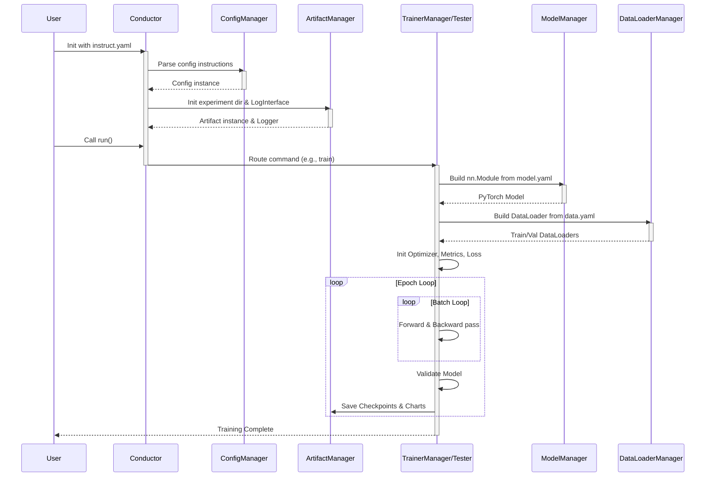

# Conductor Architecture

## 1. Overview

### 1.1 Project Introduction
**Conductor** is a highly modular computer vision (CV) deep learning training framework and experiment scheduler (Trainer) developed based on PyTorch.
It was created to address the pain points in traditional deep learning projects, such as "hard-coded model structures, high modification costs for ablation studies, and steep learning curves for beginners". Conductor borrows engineering concepts from frameworks like Ultralytics (the YOLO series), but highly simplifies and decouples the code architecture, making it more suitable for academic research, custom model development, and daily experiments by deep learning enthusiasts.

### 1.2 Core Capabilities
* **Minimalist Experiment Management**: Requires only a small amount of Python entry code; all hyperparameters, data paths, and model structures are centrally managed via YAML files.
* **Dynamic Model Construction (NAS-Friendly)**: Supports assembling network architectures (like Backbone and Head) directly via YAML lists, inherently supporting complex topological structures such as skip connections and feature fusion (e.g., FPN/PAN) without modifying the underlying `forward` function.
* **Native Distributed Support**: Built-in support for PyTorch DDP (DistributedDataParallel) multi-GPU distributed training.
* **Out-of-the-Box Engineering Components**: Integrates logging, performance evaluation (Profiler/FLOPs calculation), metrics tracking, and flexible weight and artifact management.

### 1.3 Core Mechanisms
Conductor's core mechanisms can be summarized as **"Configuration-Driven"** and **"Modular Assembly"**:
1. **Configuration-Driven**: The framework's control center (`ConfigManager`) reads the user's instruction file (e.g., `instruct.yaml`). All subsequent behaviors (which device to use, which dataset to load, whether to execute training or testing, which optimizer to call) are dispatched by this configuration object to specific execution classes.
2. **Modular Assembly**: In `model.py`, the network is no longer a massive Python class, but a list consisting of `[input source, repetition count, module name, module parameters]`. The system dynamically instantiates the corresponding `nn.Module` through reflection and the factory pattern (`ModuleProvider`), and automatically maintains a `saved` dictionary during forward propagation to route cross-layer feature flows.

### 1.4 Processing Flow
The execution lifecycle of the framework follows clear configuration distribution and resource assembly logic. The following is the typical control flow and data flow of Conductor when processing a training task:



### 1.5 Flow Details

To make the entire framework's routing logic clear at a glance, we can break down the above sequence diagram step-by-step alongside the code:

**Step 1: Initialization and Configuration Parsing**

Instantiation entry point:
```python
from conductor import Conductor
tar = Conductor('instruct.yaml')
```
When instantiating `Conductor`, the framework first reads the provided `instruct.yaml` file. The configuration dictionary is parsed by the `ConfigManager`, followed by the instantiation of the `ArtifactManager` and `LogInterface` to complete the initialization of the runtime environment.

**Step 2: Instruction Routing and Dispatching**

When `tar.run()` is called, the `run()` method of `Conductor` routes the task based on the `command` field in the configuration dictionary.
```python
# Excerpt from conductor.py
def run(self):
    if self.cm.command == 'train':
        orch = TrainerManager(self.cm, self.am, self.log)
        orch.train()
    elif self.cm.command == 'test':
        orch = Tester(...)
        orch.test()
```
At this point, control is formally handed over to the corresponding execution engine (for example, the `TrainerManager`).

**Step 3: Assembling Experiment Resources**

Once the `TrainerManager` is awakened, it initializes the two core resources required for training:
1. **Model Construction**: It calls the `ModelManager`, passing in the path to `model.yaml`. Based on the text description, the `ModelManager` dynamically assembles a real network architecture (i.e., a `Model` class instance) that can be directly `forward`-ed using PyTorch.
2. **Data Pipeline Initialization**: It calls the `DataLoaderManager`, passing in the path to `data.yaml`. This manager is responsible for parsing dataset paths and labels, and generating standard PyTorch `train_loader` and `val_loader` instances.

**Step 4: Entering the Core Loop**

With both the model and data ready, the `TrainerManager` then initializes the optimizer, loss function, and metrics collector (`MetricsManager`). Following this, it directly enters the classic PyTorch training loop:
```python
for epoch in range(epochs):
    # 1. Training Phase: Forward -> Compute Loss -> Backward -> Optimizer Step
    for batch in train_loader:
        # ...
    
    # 2. Validation Phase: Run through the validation set and compute metrics like Top-1 Acc
    self.validate()
```

**Step 5: Saving and Archiving**

At the end of each Epoch, or when the best metrics are achieved, the execution engine calls the `ArtifactManager` to store the model weights, treating the current weights as `last.pt`, and also saving them as `best.pt` if they are the historical best. Experimental artifacts such as charts plotted from various evaluation metrics and log files are all archived in the `outputs/` directory.

---

## 2. Usage Instructions

### 2.1 Environment Configuration and Prerequisites
To ensure the normal operation of the Conductor framework and the underlying operator optimization, you need to configure the runtime environment and compile the underlying C++ operators first. For convenient configuration, an `install.sh` script is provided in the project root directory.

Please ensure that Python 3 and PyTorch corresponding to your current hardware environment are already installed on your system (it needs to come with the matching CUDA toolchain and `nvcc` compiler), then run the following in the project root directory:

```bash
bash install.sh
```

This script will automatically perform the following operations:
1. Read and install the dependencies specified in `requirements.txt` (and complete the basic environment packages required for runtime).
2. Automatically enter the `modules/cuda_modules` directory to compile C++/CUDA native operators. The core of the framework (such as the dynamic activation function `DySoft` and the cross Hadamard operator `AdaptiveCrossHadamard`) strongly depends on this extension to unlock extremely low VRAM overhead.

Once the terminal prompts successful installation and compilation, the framework meets all conditions for full operation.

### 2.2 Starting Your First Training (Quick Start)
The core philosophy of Conductor is "configuration-driven". Without writing complex training loops, you only need to prepare two basic YAML files and use 3 lines of Python code to start training.

**Step 1: Prepare Data Configuration (`data.yaml`)**
First, tell the framework where your dataset is located. Please create or modify a standard dataset configuration file in the resources directory (for example, directly use the built-in example: `utils/resources/dataset_example/cifar100.yaml`).

The modern `data.py` parser supports a tree-like nested structure and can automatically infer the reading mode through file extensions (e.g., `.parquet`). The configuration example is as follows:
```yaml
task: classify
path: ./dataset            # Dataset root directory
train: 
  path: train.parquet      # Relative path to the training set
  mean: [0.507, 0.486, 0.440]  # RGB mean
  std: [0.210, 0.208, 0.215]   # RGB standard deviation
test: 
  path: test.parquet       # Relative path to the test set
  mean: [0.508, 0.487, 0.441]
  std: [0.211, 0.209, 0.216]

names:
  0: apple
  1: aquarium_fish
  # ... Class mapping table
```

**Step 2: Write Execution Instructions (`instruct.yaml`)**
This file is the general scheduler of the experiment, which links all resources and hyperparameters together:
```yaml
# Resource binding
model_yaml_path: utils/resources/example/mobilenetv4_s.yaml # Model path. Besides pointing directly to a YAML file, you can also directly call official built-in models via a special string (see the explanation below).
data_yaml_path: data.yaml 
output_dir: ./outputs # Sandbox directory for storing logs and weights generated by the experiment

# Core instructions
command: train   # Tells the framework to execute a training task this time
task: classify   # Must align with the data configuration

# Hyperparameters
epochs: 50
batch_size: 128
device: cuda
world: [0]       # Distributed card number. Write [0] for a single card; write [0, 1] to seamlessly enable DDP dual-card training
criterion: CrossEntropyLoss
optimizer: AdamW
scheduler: CosineAnnealingLR
learn_rate: 0.001
decay: 0.0001
best_metrics: top1_acc # Validation benchmark for saving the model
```

> **Supplement: How to call built-in models with one click?**
> `model_yaml_path` not only supports filling in the YAML file path, but also supports a powerful string reflection mechanism. If you want to directly use classic networks in `torchvision`, or Python models pre-installed in the framework's `models/` directory (such as MobileViT), you can directly fill in a string in the format of `<model_name>,<parameter_dictionary>`.
> 
> For example:
> * `model_yaml_path: shufflenet_v2_x1_0,{'num_classes':100}`
> * `model_yaml_path: mobilevit,{'num_classes':100,'mode':'xx_small'}`
> 
> *Note: When using this mode, since the system cannot infer the task type from the YAML file, the `task: classify` field in `instruct.yaml` must be explicitly declared, and the parameter dictionary must contain the `num_classes` key.*

**Step 3: Start the Task**
Create a `main.py` script in any valid calling directory of the project, pass the scheduling instruction file to `Conductor`, and run it:
```python
from conductor import Conductor

# Instantiate the conductor and specify the configuration file path
tar = Conductor('instruct.yaml')
# Start the training lifecycle with one click
tar.run()
```
After execution, all historical line charts (`result.png`), progress logs (`metrics.csv`), and the best model weights (`weights/best.pt`) will be neatly collected in the `outputs/task_0/` directory.

### 2.3 Advanced I: Building Networks with YAML "Building Blocks"
The most attractive feature of Conductor is: **you do not need to write a traditional `forward` function in Python**. All network topologies and cross-layer connections (Skip Connections) are defined as lists in the YAML file.

#### Core Syntax Parsing: `[f, n, m, args]`
In the `backbone` or `head` list of `model.yaml`, each line represents a network layer module. Its standard format is a list containing four elements:
* **`f` (from, input source)**:
  * `-1`: Default value, represents receiving the output of the previous layer as the input of the current layer (classic serial structure).
  * `integer` (e.g., `2`): Represents receiving the output of layer 2 across layers (network layer index starts from 0).
  * `list` (e.g., `[-1, 2]`): Represents receiving the outputs of both the previous layer and layer 2 simultaneously (commonly used for multi-branch feature fusion operators).
* **`n` (number, repetitions)**: The number of times this module needs to be continuously repeatedly instantiated (if greater than 1, the framework will automatically wrap it into `nn.Sequential`).
* **`m` (module, module class name)**: The corresponding network component name, which must match the class name defined in the `modules/` directory (or PyTorch native `nn`). For example, basic convolution `ConvNormAct`, classification head `Classifier`.
* **`args` (arguments, module parameters)**: A list of specific parameters passed to the initialization function of the module. It usually follows the pattern of `[output channels, kernel size, stride...]`; please refer to the `yaml_args_parser` method of the corresponding class for details.

#### Minimalist Practical Example
Below is a sample configuration of a customized lightweight network with residual blocks and a basic classification head. You can directly save it as `custom_model.yaml` and point `model_yaml_path` to it in `instruct.yaml`:

```yaml
nc: 100 # Number of classes
task: classify

# [from, repeats, module, args]
backbone:
  # Layer 0: Initial convolution (Input RGB 3 channels, output 16 channels, 3x3 kernel, stride 2 downsampling)
  - [-1, 1, ConvNormAct, [[16, 3, 2], BatchNorm2d, ReLU]] 
  
  # Layer 1: Inverted residual block (Output 24 channels, intermediate expansion channel 72, 3x3 kernel, stride 2)
  - [-1, 1, InvertedResidual, [24, 72, 3, 2, 1, false, ReLU]] 
  
  # Layer 2: Continue to stack an inverted residual block
  - [-1, 1, InvertedResidual, [40, 96, 5, 2, 1, true, Hardswish]]
  
  # Layer 3: End with a 1x1 convolution to increase dimensions to 576 channels
  - [-1, 1, ConvNormAct, [[576, 1, 1], BatchNorm2d, Hardswish]]

head:
  # Layer 4: Classification head. Receives the feature map of layer 3, outputs 100 classes, hidden layer channels 1024, Dropout rate 0.3
  - [-1, 1, Classifier, [100, 1024, 0.3]]
```

### 2.4 Advanced II: Testing, Diagnostics, and Computation Power Evaluation
In addition to standard model training, Conductor also features built-in one-click tools for model evaluation and computation analysis. Simply modify the `command` field in `instruct.yaml` to switch the working mode.

#### 1. Model Testing and Diagnostics (`command: test`)
When you need to evaluate a trained model:
1. Set `command: test` in `instruct.yaml`.
2. Be sure to configure `ckpt: outputs/task_0/weights/best.pt` to specify the path to the weight file you want to test.
3. Run `main.py`.

In test mode, besides printing the final confusion matrix and metrics like Precision/Recall in the terminal, the framework will also automatically generate in the output directory:
* **`sample.png`**: An image grid randomly sampled from the validation set, annotated with Ground Truth versus Model Prediction below the image, intuitively demonstrating the predictive performance of the model.
* **`focus.png`**: A diagnostic collage generated by targeted sampling specifically for the worst-performing classes (lowest recognition rate) in the confusion matrix. This helps researchers quickly locate "hard examples" or annotation errors in the dataset.

#### 2. Computation Power Evaluation (`command: profile`)
During lightweight network design, rigorous computational cost evaluation is essential.
1. Set `command: profile` in `instruct.yaml`.
2. (Optional) If you only want to evaluate the base model without loading specific weights, you can set `ckpt` to `null`.
3. Run `main.py`.

In Profiler mode, the framework will not rely on a real dataset but instead uses virtual tensors to execute forward propagation. It will automatically print out the following for the network topology at the current input resolution:
* **Total Parameters**: Total parameter count of the model.
* **MACs / FLOPs**: Multiply-Accumulate Operations / Floating Point Operations.
At the same time, it will export the model graph to `.onnx` format and save it in the output directory, making it convenient for you to import into third-party tools like Netron to view the computation graph nodes.

### 2.5 Advanced III: Enabling Differentiable Architecture Search (NAS)
Conductor natively supports GDAS-based Differentiable Architecture Search (NAS). This feature allows building complex search spaces where the model can automatically perform structural optimization based on training data and gradient feedback, selecting between different feature extraction modules (such as Ghost or ACH), and even across network depths.

**Step 1: Configure Dual Optimizers in `instruct.yaml`**
Architecture search requires alternating updates from dual optimizers. **Note: The learning rate for architecture parameters (NAS) should generally be much smaller than the learning rate for network weights to ensure search stability.** Add a `nas` configuration block in the instruction file:
```yaml
# Main optimizer for network weights
optimizer: AdamW
learn_rate: 0.003
# ... other basic configurations remain unchanged ...

# Exclusive optimizer for architecture parameters
nas:
  optimizer: AdamW
  learn_rate: 3e-4   # Recommended to be an order of magnitude lower than the main learning rate
  max_tau: 4.0       # Gumbel-Softmax temperature at the initial stage of search, higher means more uniform exploration
  min_tau: 0.1       # Temperature at the final stage of search, lower means closer to a single deterministic structure
  annealing: cos     # Uses cosine annealing
```

**Step 2: Define the Search Space in `model.yaml`**
Instead of using hardcoded traditional modules, the framework provides flexible `Searchable` containers. Depending on the optimization level, you can choose one of the following four core modules:

1. **`SearchableBlank` (Network Depth Optimization)**:
   * This is a placeholder that performs identity mapping (i.e., skipping the layer).
   * **Argument Format**: `[output_channels]`. Note: Its input and output channel counts must be equal.
   * **Example**: `- [-1, 1, SearchableBlank, [64]]`.

2. **`SearchableModule` (Native Module Search)**:
   * Allows searching among standard PyTorch modules. This module **does not** recursively parse internal YAML arguments, so it requires you to manually complete all initialization arguments for each candidate module when constructing the YAML.
   * **Argument Format**: `[output_channels, [module_1_name, [argument_list_1]], [module_2_name, [argument_list_2]], ...]`.
   * **Example**: `- [-1, 1, SearchableModule, [32, [nn.Conv2d, [16, 32, 3, 1, 1]], [nn.Conv2d, [16, 32, 5, 1, 2]]]]`.

3. **`SearchableBaseModule` (Macro-architecture Search - Most Commonly Used)**:
   * Used for macroscopic optimization of the framework's built-in custom complex modules inheriting from `BaseModule` (e.g., `AdaptiveBottleneck`, `GhostModule`). It recursively calls the sub-modules' own `yaml_args_parser` for secure parsing and supports nested serialization.
   * **Argument Format**: Identical to `SearchableModule`, but the first argument in its internal candidate list must be the correct output channel count `c2`.
   * **Example**:
     ```yaml
     - [-1, 1, SearchableBaseModule, [64, 
         # Candidate 1: Use the Ghost feature block
         [AdaptiveBottleneck, [64, Ghost, 2.0, 3, 1]],
         # Candidate 2: Use the adaptive Hadamard operator
         [AdaptiveBottleneck, [64, Hada, 16, 3, 1, "DySoft"]],
         # Candidate 3: Identity mapping. Equivalent to skipping the current layer, allowing the network to learn the structural decision of depth optimization.
         [SearchableBlank, [64]],
       ]]
     ```

4. **`SearchableConvNormAct` (Fine-grained Operator Search)**:
   * This is a specialized version compromised for performance. It specializes in searching across convolution kernels of different sizes, stripping `BatchNorm` and activation functions out of the search space as shared post-processing components to save VRAM.
   * **Argument Format**: `[[output_channels, [list_of_candidate_kernel_sizes], stride, ...], normalization_layer, activation_function]`.
   * **Example**: `- [-1, 1, SearchableConvNormAct, [[32, [2, 3, 5], 2], BatchNorm2d, null]]` (Optimizing among 2x2, 3x3, and 5x5 convolution kernels).

Running `command: train` with this configuration will enter the alternating search NAS Epochs. Once the search phase converges, calling the model's `get_optimal()` method will discretize the search space (`argmax`) and export the finalized static PyTorch model configuration.

---

## 3. Architectural Description

This section provides a top-down, in-depth analysis of the Conductor framework's underlying code design. We will start from the macroscopic scheduling center, gradually dismantle the model building engine and data pipeline, and finally delve into the specific components executing training and evaluation. This part serves as the best reference for understanding the framework's internal mechanisms, performing deep customization, and conducting secondary development.

### 3.1 Core Control Layer

The core control layer is responsible for translating user-provided static text instructions into executable Python objects and PyTorch computation graphs. It consists of three top-level files: `conductor.py` handles process scheduling, `model.py` manages network topology parsing, and `data.py` directs data flow.

#### `conductor.py` 

This is the execution entry point of the entire framework. It does not involve specific tensor operations, loss calculations, or dataset traversal logic; it is solely responsible for configuration initialization and routing distribution.

* **Initializing Infrastructure**: Upon instantiating the `Conductor` class, it reads the configuration file (e.g., `instruct.yaml`) and passes it to the singleton `ConfigManager` for parsing. Immediately following this, it instantiates `ArtifactManager` to set up experiment-related output directories and initializes `LogInterface` to establish the global logging system.
* **Dynamic Routing**: The `run` method branches by checking the `command` field in the configuration object. As shown in the code below, it instantiates the corresponding manager based on the instruction and transfers control. If new functionalities need to be added in the future, simply add new `elif` branches here.

```python
def run(self):
    if self.cm.command == 'train':
        orch = TrainerManager(self.cm, self.am, self.log)
        orch.train()
    elif self.cm.command == 'test':
        orch = Tester(self.cm, self.am, self.log)
        orch.test()
    # ... other branches
```

#### `model.py`

Responsible for translating network architecture descriptions into `nn.Module` instances capable of executing forward propagation in PyTorch.

* **`ModelManager` Class**: Coordinates model building. To ensure backward compatibility and provide high customization capabilities, it supports parsing two input modes:
  * **Built-in Mode**: If a string like `torchvision.models.resnet18` is explicitly specified in the configuration file, the manager will instantiate the pre-trained model using reflection mechanisms.
  * **YAML Mode**: Reads custom topology structure files, parsing and validating parameters for each item in the network layer list (such as input sources, module names, and hyperparameters).

* **`Model` Class**: When parsing in YAML mode, an instance of this class is generated. It breaks the traditional PyTorch limitation of hardcoding the `forward` function. During initialization, based on the configuration list, it uses reflection to instantiate basic network blocks from the component library and stores them in an `nn.ModuleList`.
Its core logic lies within the `_forward_impl` method. During forward propagation, it iterates through the module list. Each module determines its input source based on the `from` field in the configuration. If `from` is -1, it receives the previous layer's output; if it is a specific layer index, it extracts the cached feature map from the local `saved` dictionary.

```python
def _forward_impl(self, x: Tensor) -> Tensor:
    saved = dict()
    for layer in self.layers:
        # Determine the input source and execute forward
        if layer.f != -1:
            x = layer(*(saved.get(i) for i in ([layer.f] if isinstance(layer.f, int) else layer.f)))
        else:
            x = layer(x)
            
        # If the current layer's output will be used in the future, store it in the saved dictionary for caching
        if layer.i in self.save:
            saved[layer.i] = x
    return x
```
Relying on this dictionary-based dynamic routing and feature caching mechanism makes adding residual connections or cross-layer feature fusion extremely simple.

#### `data.py`

Responsible for converting data on storage media like hard drives into the tensor streams required for PyTorch training.

* **`DataLoaderManager` Class**: Parses the `data.yaml` configuration, reading dataset paths, category information, and task types. It wraps PyTorch's `DataLoader`. Additionally, it includes adaptation logic for distributed training; when the `ConfigManager` indicates DDP is enabled, it automatically wraps the dataset with a `DistributedSampler` to ensure accurate data partitioning across multiple GPUs.
* **`ClassifyDataset` Class**: The framework's built-in dataset implementation for classification tasks. To optimize the data reading bottleneck, it provides dedicated support for `parquet` format data tables. More importantly, it internally implements a high-speed caching mechanism based on `pickle` (generating `.cache` files). This not only avoids repeated hard drive reads during training but also caches the **decoded** `PIL.Image` objects, vastly reducing the computational bottleneck of CPU data preprocessing.

```python
def _getitem_original_(self, index):
    if index in self.cache:
        # Cache hit, return directly
        img, label = self.cache[index]
    else:
        # Cache miss, read from disk or parquet and write to cache
        if self.format == 'parquet':
            img, label = self._getitem_parquet_(index)
        self.cache[index] = (img, label)
        
    img = self.trm_enhance(img)
    return img, label
```

### 3.2 Execution Engine

The execution engine manages the operation of the model's entire lifecycle, encompassing core business logic such as forward propagation, backward propagation, evaluation, visualization, and performance profiling. It mainly consists of `test.py`, `train.py`, and `profiler.py`. To clarify their dependencies, we will first start with the testing engine.

#### `test.py`

Exclusively responsible for evaluating the model on validation or test sets, and provides rich visualization and analysis tools to help researchers deeply understand the model's performance.

* **`Tester` Class**: As the base class for testing and evaluation logic, its core responsibility is to validate model performance without calculating gradients.
  * **Metrics and Confusion Matrix**: The core evaluation logic resides in the `test_epoch` method. It iterates through the data stream within a `torch.no_grad()` context, uses a custom `Recorder` to log all predictions and ground truth labels, and calculates Precision and Recall for each class based on the confusion matrix.
  
  ```python
  # test_epoch core metric calculation
  precision = Calculate.precision(self.recorder.get_conf_mat())
  recall = Calculate.recall(self.recorder.get_conf_mat())
  ```
  * **Diagnostic Toolset**: Not limited to outputting accuracy, `Tester` has several built-in practical diagnostic functions:
    * `latency`: Calculates the model's average inference time (ms) through multiple forward passes.
    * `sampling` / `focusing`: Randomly samples validation set images, or specifically extracts categories that perform worst in the confusion matrix, drawing and saving "model predicted label vs. ground truth label" comparison charts to facilitate troubleshooting dataset issues.
  * **Interpretability Tools (`GradCAM`)**: By registering forward and backward propagation hooks on specified convolutional layers, it intercepts feature maps and gradients, calculates and outputs feature heatmaps, intuitively displaying the model's attention areas when making decisions.
    Although the default flow of the `test` method does not directly invoke `GradCAM`, the framework provides a very convenient interface via `get_cam()` for users to conduct interpretability analysis in custom scripts. Users simply need to obtain the tester instance and specify the network layer they wish to observe:
    
    ```python
    tester = Tester(cm, am, log)
    tester.model = tester.model_mng.build_model()
    
    # Instantiate the GradCAM analyzer
    cam_analyzer = tester.get_cam()
    
    # Get the target layer for analysis, such as the last convolution block of the model
    # The tester.model.layers here is the ModuleList dynamically built in model.py
    target_layer = tester.model.layers[-2]  
    
    # Pass in the single image tensor to be analyzed (must have a batch dimension BCHW)
    # generate_cam will automatically register Hooks, execute forward/backward propagation, and return the normalized numpy heatmap
    heatmap_numpy = cam_analyzer.generate_cam(input_tensor, target_layer)
    ```

#### `train.py`

Encapsulates the complete training lifecycle of the model from initialization to convergence. This module natively supports PyTorch DDP (DistributedDataParallel) multi-GPU distributed training.

* **Inheritance Mechanism and State Isolation**: At the code level, `class Trainer(Tester):` clearly indicates the inheritance relationship between the two. This design allows the trainer to directly reuse validation logic such as `test_epoch` at the end of each Epoch.
  To ensure that the two executors do not conflict in their running states, `Trainer` overrides the `__init__` method **and deliberately does not call `super().__init__()`**. Because under multi-GPU distributed training, `Trainer` runs in multiple parallel processes (corresponding to multiple `rank`s), it must independently manage exclusive states like the CUDA `device` binding belonging to the current process. By manually binding the infrastructure objects required for `test_epoch` to its own instance (e.g., `self.cm`, `self.log`, `self.device`), `Trainer` can safely and seamlessly call the parent class's methods, thoroughly avoiding process conflicts or state pollution issues that independent initialization of the parent class might bring.
* **`TrainerManager` DDP Spawning**: Externally coordinated by `TrainerManager`. If the configuration indicates enabling multi-GPU training, it calls `torch.multiprocessing.spawn` to spawn multiple parallel `Trainer` instances.
* **`Trainer` Class Core Functions**:
  * **Distributed Initialization**: Calls `dist.init_process_group` during the initialization phase to establish the process communication group, and wraps the native PyTorch model into a `DistributedDataParallel` container.
  * **Lifecycle Loop and Alternating NAS Training**: Responsible for managing `Optimizer`, `LR_Scheduler`, and loss functions. In standard training, the Epoch loop internally executes the classic steps of `forward -> compute loss -> backward -> optimizer step`. Specifically, if the framework detects that the model contains NAS components, it seamlessly switches to `nas_epoch()`. At this point, the trainer maintains two independent sets of optimizers: one for regular network weights (`weights`), and another for architecture parameters (`nas_alpha`, `nas_tau`), updating them alternately to prevent architecture search from falling into severe overfitting. After each training round, it calls the parent class's `test_epoch` to evaluate the validation set, and finally, the main process (e.g., `rank 0`) is responsible for saving the best Checkpoint files and training log charts to disk.

#### `profiler.py`

An independent performance profiling component used to statically estimate the model's theoretical complexity.

* **`Profiler` Class**: It does not rely on real datasets. It generates the model based on the user configuration file and constructs random tensor inputs matching the `imgsz` shape. Subsequently, by calling `torchinfo.summary`, it automatically estimates and prints to the terminal and logs the model's total parameter count (Parameters) and the multiply-accumulate operations (MACs / FLOPs) at a specific resolution. This is an indispensable quantitative metric for guiding lightweight model design.

### 3.3 Built-in Model Library (`models` directory)

The `models` directory contains a series of complete computer vision models included with the framework, written and hardcoded based on traditional PyTorch classes (`nn.Module`). These models can be directly invoked through `ModelManager`'s built-in mode (`bt`). This directory primarily provides classic lightweight baseline networks, as well as the author's original experimental architectures.

#### Classic Lightweight Baseline Networks (Baselines)
To facilitate performance comparisons and Baseline testing, the directory includes built-in reproductions of mainstream edge-side lightweight models in the industry:

* **`ghostnet.py` & `ghostnetv3.py`**: Reproduces the GhostNet series networks proposed by Huawei Noah's Ark Lab. It includes its iconic `GhostModule` (generating more feature maps via cheap linear operations) and `GhostBottleneck` structures.
* **`mobilevit.py`**: Reproduces Apple's MobileViT. This network ingeniously combines the local perception capabilities of CNNs with the global modeling capabilities of Transformers (`MultiHeadAttention` and `TransformerEncoder`), making it a representative of lightweight hybrid architectures.

#### Experimental Architecture Networks
This part serves as an experimental ground for the author to explore novel operators and attention mechanisms, and is also the most distinctive part of the `models` directory.

* **`ach_bnc.py` (Adaptive Cross Hadamard Product and Bottleneck Layer)**:
  This is the core implementation file for the author's original `ACH` (Adaptive Cross Hadamard) mechanism.
  * **`AdaptiveCrossHadamard` (ACH)**: A novel adaptive feature extraction operator that internally maintains temperature coefficient parameters such as `tau_init`, aiming to extract richer feature representations through cross Hadamard product operations.
  * **`AdaptiveBottleneckBNC`**: Here, `BNC` represents an adaptation layer design for the tensor shape `(B, N, C)`. Standard CNN operators typically receive image tensors in the `(B, C, H, W)` format, whereas Transformer encoders like those in MobileViT process flattened feature sequences in the `(B, N, C)` format (Batch, Sequence Length N, Channels C). The role of `AdaptiveBottleneckBNC` is to act as a bridge; it internally calls the `ACH` operator and performs flexible dimensional conversions and alignments on input/output tensor shapes (for example, internally converting to `(B, C, N, 1)` to be processed by a CNN before converting back to `(B, N, C)`), enabling it to be seamlessly embedded into Transformer blocks or similar sequence-processing network structures.

* **`mobilevit_ach.py`**:
  This is a heavily modified version based on the standard `mobilevit.py` source code by the author. By introducing the `AdaptiveBottleneckBNC` defined in `ach_bnc.py`, it perfectly integrates the original `ACH` mechanism into MobileViT's block structures, thereby deriving a novel hybrid vision model with custom feature extraction mechanisms.

### 3.4 Dynamic Building Block Components (`modules` directory)

This is the core component library enabling the Conductor framework's "configuration-driven model assembly," and it is also the hub for the author's operator ablation experiments. It stores highly decoupled network layer components that can be directly invoked by `model.yaml`.

#### `module.py`
This file constitutes the underlying logic abstraction for dynamic model assembly and takes over the responsibilities previously held by `_utils.py`.
* **`BaseModule`**: All dynamic building blocks must inherit from this base class. It mandates that subclasses implement the static method `yaml_args_parser`. This acts as a "parameter unpacker," responsible for precisely translating rough lists like `[16, 3, 2]` from the YAML into the detailed parameter dictionaries required by the current class's `__init__` function.
* **`ModuleProvider`**: The static registry center for global components. Through a lazily loaded singleton dictionary `_modules_dict`, it maps string names (like `"HadamardResidual"`) to actual Python classes. This empowers the framework with the capability to accomplish model instantiation based entirely on plain text configurations.
* **`_convert_str2class`**: A parsing utility function responsible for converting activation function or normalization layer names in the configuration list into their corresponding PyTorch module classes.

#### `conv.py`
Primarily encapsulates basic convolution operation components, architecture search extensions, and related mathematical utility functions.
* **`_autopad`**: An auto-padding utility function. Given a Kernel Size and Dilation rate, it automatically calculates the Padding size needed to maintain the feature map's spatial resolution.
* **`ConvNormAct`**: The most fundamental building block unit in the framework. It performs a standard sequential fusion encapsulation of `nn.Conv2d`, a normalization layer (optional, defaults to `BatchNorm2d`), and a non-linear activation layer (optional, defaults to `SiLU`).
* **`SearchableConvNormAct`**: A searchable convolution block integrating NAS capabilities. Inheriting from `SearchableModule`, it receives a Kernel Size in **list** format during initialization (e.g., `k=[3, 5, 7]`), thereby instantiating multiple convolutional layers of corresponding sizes in parallel. During forward propagation, it relies on the parent class's mechanism to perform a differentiable soft-weighted sum on the outputs of multiple convolution branches, finally conducting unified normalization and activation. This is a core component for achieving automatic convolution kernel size search.
* *[Note] Experimental Legacy*: The file also contains two classes, `RepConv` and `MeanFilter`. `RepConv` only implements a static method for fusing convolution kernel Padding and BatchNorm, serving as an incomplete prototype for structural re-parameterization technology; `MeanFilter` is a mean filtering block with fixed weights. Both are currently not invoked on a large scale in the backbone networks, belonging to the phase products of the author verifying specific concepts.

#### `head.py`
Responsible for defining the task output heads at the end of the model.
* **`Classifier`**: A standard classification head, utilizing adaptive average pooling to flatten feature maps, and accomplishes classification mapping through two linear layers, an intermediate hidden layer, and Dropout.
* **`ClassifierSimple`**: A minimalist classification head designed for lightweight models, outputting categories directly via a single-layer linear mapping post-pooling, removing the complex fully connected hidden layer.

#### `block.py`
This file is the centerpiece of the entire network structure, centrally demonstrating the ingenuity of industry lightweight network designs and compiling the author's original core feature extraction operators.
* **`InvertedResidual`**: Reproduces and encapsulates the classic inverted residual blocks from MobileNetV2/V3.
* **`UniversalInvertedBottleneck`**: Reproduces the core module of MobileNetV4 (UIBC). Its design is extremely inclusive; by passing different `start_k` and `mid_k` kernel size parameters in YAML, this single module can dynamically degrade into FFN, ExtraDW, IB, or ConvNext blocks, making it the cornerstone for building V4 series networks.
* **`GhostModule`**: An inexpensive feature generation module. As a sub-component, it is widely embedded and invoked in the author's subsequent experimental blocks.
* **`StarBlock`**: The core building block of the StarNet network.
* **`AdaptiveCrossHadamard` (ACH)**: The author's original core operator. In traditional inverted residual designs, 1x1 convolutions are usually used for channel expansion. ACH abandons this approach, utilizing the **Hadamard Product** across channels for feature expansion. The module also integrates an evaluation network (`eva_net`) composed of `ECA` attention and Gumbel-Softmax (control parameter `tau`), used to dynamically and adaptively gate the cross-multiplied channels.
* **`AdaptiveBottleneck`**: A highly versatile and frequently used experimental container block. It accepts a `method` parameter in YAML. If `method='Ghost'`, it internally degrades to call `GhostModule`; if `method='Hada'`, it assembles and enables the `AdaptiveCrossHadamard` operator. In the author's `hadaptivenet` series of configurations, this module is extensively used for comparative ablation experiments between the two.
* *[Note] Experimental Legacy/Redundant Code*: The file also contains `HadamardExpansion` and `HadamardResidual` classes. Engineering search indicates these are early versions of the author's initial attempts to use Hadamard products for expansion. They are currently no longer invoked in any YAML configuration tables under `utils/resources` (having been entirely superseded by their evolved version `AdaptiveBottleneck` combined with the ACH operator), and belong to obsolete redundant code that can be cleaned up.

#### `nas.py`
This module injects differentiable architecture search (NAS) capabilities based on the GDAS (Gradient-based DARTS) style into the framework.

* **TauScheduler**
  A temperature coefficient (`tau`) annealing scheduler used in conjunction with Gumbel-Softmax.
  It provides various annealing strategies like `cos` (cosine) and `linear`. In the early stages of the search, a higher `tau` value makes the Gumbel distribution closer to a uniform distribution, encouraging the model to fully explore all candidate branches; as training Epochs progress, `tau` gradually anneals to a minimal value near 0, at which point the distribution rapidly collapses toward `argmax` (i.e., becoming a deterministic hard selection), prompting the model architecture to stably converge.

* **Searchable Series**
  These four classes form the core elastic containers for architecture search, holding explicit inheritance and functional divisions among them:
  * **SearchableBlank**: Inheriting from `BaseModule`, it is an extremely lightweight placeholder (Identity mapping). Its `forward` simply returns the input tensor `x`. In the search space, it typically appears as one of the candidate operators, allowing the network to learn structural decisions to "skip the current layer" (similar to a residual connection).
  * **SearchableModule**: Inheriting from `BaseModule`, it is the core base class for implementing GDAS. During initialization, it receives a set of arbitrary `nn.Module`s as candidate operators and internally maintains the architecture parameter `nas_alpha`.
  * **SearchableBaseModule**: Inheriting from `SearchableModule`. It inherits the parent class's core forward propagation logic, but its main difference lies in its **support level for YAML serialization**. While `SearchableModule` can only bluntly handle standard PyTorch operators, `SearchableBaseModule` is specifically designed to wrap custom complex building blocks that also inherit from `BaseModule`. By recursively calling sub-modules' `yaml_args_parser` and `get_yaml_obj`, it can perfectly reverse-serialize deeply nested custom operator search states into YAML files.
  * **SearchableConvNormAct (located in `conv.py`)**: Also inheriting from `SearchableModule`, but it is a highly specialized, optimized version compromised for extreme performance. It no longer receives ready-made candidate module instances; instead, it receives a list of kernel sizes (e.g., `k=[3, 5, 7]`) and internally instantiates multiple pure `nn.Conv2d`s in parallel for the parent class to search. Most crucially, to save VRAM, it **strips normalization layers (like BatchNorm) and activation layers out of the search space, serving as a single post-processing component shared by all convolution branches**.

* **NAS Operational Principles Analysis**
  The essence of the entire search mechanism lies in the forward propagation (`forward`) and export (`get_optimal`) stages of `SearchableModule`:
  1. **Discrete Sampling and Continuous Gradients**: During forward propagation, the framework applies `F.gumbel_softmax(..., hard=True)` to `nas_alpha`. `hard=True` guarantees that the model activates only a single operator branch (in One-hot format) during forward calculation, immensely saving VRAM and computational load. However, during backward propagation, thanks to the Gumbel-Softmax trick, gradients can be continuously distributed to all candidate operators, guiding the updating of architecture parameters.
  2. **Architecture Solidification**: When training (the search phase) ends, as `TauScheduler` drops the temperature to an extremely low level, the distribution of `nas_alpha` is highly determined. Calling the `get_optimal()` method at this moment will execute `argmax` on `nas_alpha`, discarding all unselected redundant branches, instantly "collapsing" the dynamic search container into a standard, static PyTorch model, and exporting it as the final deployment configuration.

#### `misc.py`
Stores fine-grained activation functions, normalization layers, and attention auxiliary parts, typically embedded as underlying components inside macro-modules (like ACH).

* **Dynamic Algebra Cluster (`Dy` Series) and Normalization Operators**: Contains `DySoft`, `DySig`, `DyAlge`, `DyT`, as well as general normalization operators `RMSNorm` and `MVE` (Mean Variance Estimator). They no longer use fixed mathematical activation curves; instead, they treat the activation functions' scaling coefficients (`alpha`), weights, and even biases as learnable `nn.Parameter`s, allowing the network to fit the non-linear response best suited for the current data stream distribution on its own during backward propagation. Among them, `DySoft` is currently the default dynamic activation scheme chosen for the Hadamard cross mechanism, while `RMSNorm`, `DyT`, and `MVE` are strong candidates for lateral comparison in ablation experiments against it, and they are also highly valuable as universal low-level operators.
* **`ECA` (Efficient Channel Attention)**: This is an extremely crucial link in the current framework. In the `AdaptiveCrossHadamard` operator, it acts as the evaluation network (`eva_net`), responsible for efficiently extracting global channel attention via 1D convolution and adaptive average pooling, which subsequently provides feature scoring for the ensuing Gumbel-Softmax gating.
* *[Note] Deprecation Notice*: The `CrossHadaNorm` previously included in this file was a failed experimental attempt with poor performance, and it has now been completely deprecated and removed from the codebase.

#### `cuda_modules/`
Provides underlying C++/CUDA native operator extensions to break through VRAM and performance bottlenecks. Purely relying on PyTorch Python APIs (like complex slicing, `view`, and `torch.mul` concatenation) to implement the complex channel cross-combination operations of `AdaptiveCrossHadamard` (ACH) will cause backward propagation to generate massive and fragmented computation graph nodes, resulting in severe VRAM bloat and computational lag. To resolve this industrial implementation bottleneck, this directory includes a complete custom CUDA operator ecosystem.

Because underlying C++/CUDA code has a relatively high reading barrier, the core files are detailed one by one below:

* **`setup.py` & `cdt_extensions.cpp/.h/.pyi` (Build and Binding Layer)**:
  This is a standard PyTorch C++ extension build suite. `setup.py` utilizes `pybind11` to compile the underlying CUDA kernel functions into dynamic-link libraries (`.so`). `cdt_extensions.cpp` serves as the interface bridge, safely exposing C++ functions to the Python environment, while the `.pyi` file provides clear Type Hints for the caller side.

* **`dysoft.cu` (Dynamic Activation Operator Fusion)**:
  Implements the underlying parallel computation for the `DySoft` dynamic activation function. This file performs thorough **Kernel Fusion** between a Softsign-like non-linear activation curve and channel-level affine transformations (scaling and translation). More crucially, it adopts an **In-place** strategy, overwriting computational results directly onto the input tensor's memory address, squeezing the activation layer's additional VRAM consumption down to zero.

* **`cross_hada.cu` (Core Cross Hadamard Operator)**:
  This is the heart of the entire directory, dedicated to extremely accelerating the most time-consuming "pairwise channel combination multiplication" operation in ACH. To extract maximum GPU computing power, the author applies extremely hardcore mathematical optimization here: **abandoning inefficient 2D nested loops, and utilizing the quadratic equation root-finding method ($O(1)$ time complexity) to reversely map flat 1D GPU thread IDs directly into 2D upper triangular matrix indices `(i, j)`**. This file provides three scheduling variants to handle different scenarios:
  1. `crossHadamard`: Basic global pairwise cross-combination computation.
  2. `crossHadamardMixed`: A variant integrating Top-K routing logic, only computing combinations for the top K highest-scoring channels to avoid redundant calculations.
  3. `crossHadamardBalanced`: Mathematically completely equivalent to the basic version, but reconstructs GPU thread block strides and odd-even scheduling logic, attempting to optimize memory continuous access performance through more complex load balancing strategies.

* **`test_correctness.py` (Correctness Verification)**:
  A rigorous industrial-grade operator must include a perfect testing loop. This script focuses on **Correctness Alignment**: it uses native PyTorch Python APIs to implement an unoptimized "control group," and strictly asserts that the CUDA operator's output results perfectly match it across various tensor dimensions and data types.

* **`test_latency.py` (Performance Benchmarking)**:
  This script handles professional speed testing logic (like `torch.cuda.synchronize()` barriers and Warm-up). It iterates through different Batch Sizes, channel numbers, and spatial resolutions, records the execution time of pure PyTorch vs. custom CUDA operators, and stores the benchmark data in `.npz` files.

* **`plot_benchmarks.py` (Performance Advantage Heatmap)**:
  A visual diagnostic script. It reads the benchmark data produced by `test_latency.py`, and utilizes `seaborn` and `matplotlib` to plot a warm-cool color-toned performance comparison Heatmap. It intuitively and quantitatively shows researchers the absolute advantage intervals of different operator implementations across various tensor shapes.

### 3.5 Infrastructure Library (`utils` directory)

Although the `utils` directory is located at the innermost layer, it forms the "nervous system" and "logistical support" of the entire Conductor framework. Without them, both dynamic model assembly and distributed training would be unable to run. We divide them into three major subsystems: configuration and resource management, terminal interaction, and metric statistics and visualization.

#### `back.py`
This file provides two core manager classes that play global supporting roles throughout the framework's lifecycle.

* **`ConfigManager` (Configuration Parsing and Dynamic Assembly)**
  This is the configuration factory for the entire framework, responsible for converting static YAML text into real PyTorch runtime objects.
  * **String Reflection Instantiation**: It takes strings configured in `instruct.yaml` (e.g., `optimizer: AdamW`) and utilizes `getattr` to dynamically reflect, retrieve, and validate the corresponding `torch.optim.AdamW` class, with loss functions and schedulers treated similarly.
  * **Intelligent Scheduler Composition (`build_scheduler`)**: This class has excellent built-in learning rate scheduling logic. Not only does it support various scheduling strategies like Cosine, Step, and One-Cycle, but it also automatically calculates the warm-up period (`warmup_epochs`) based on the configuration file, seamlessly stitching linear warm-up with the main scheduler via `SequentialLR`.
  * **NAS Hyperparameter Isolation**: For differentiable architecture search, it intercepts and independently validates NAS-specific optimizers, learning rates, and temperature (Tau) extreme values during the parsing phase, providing configuration safeguards for subsequent alternating dual-optimizer training.

  **Usage Example:**
  ```python
  # Initialize ConfigManager from a YAML dictionary or path
  cm, _ = ConfigManager.get_instance(model_yaml_path='model.yaml', data_yaml_path='data.yaml', command='train')
  # Determine whether distributed training is enabled
  if cm.isddp():
      print(f"DDP Mode is active with world {cm.world}")
  # Automatically construct the optimizer using reflection
  optimizer = cm.build_optimizer(model.parameters(), cm.optimizer, lr=cm.learn_rate, decay=cm.decay)
  ```

* **`ArtifactManager` (Experiment Sandbox and I/O Bridge)**
  Every execution of `run` is accompanied by a large volume of intermediate artifacts (weight files, log texts, prediction images). `ArtifactManager` assumes full authority over the framework's file I/O behavior.
  * **Overwrite-Proof Sandboxing**: Upon initialization, it automatically sniffs out and creates auto-incremented isolated folders like `task_0`, `task_1` within the output directory as experiment sandboxes, completely eliminating mutual overwriting between different experiments.
  * **Unified Paths and Output Distribution**: It internally defines all standardized paths such as `console.log`, `metrics.csv`, and `weights/best.pt`. Moreover, it acts as an I/O Facade—when the execution engine needs to save visualization results, it merely calls `am.plot_samples()`, and the manager will automatically route the data flow to the underlying `plot.py` for rendering and accurately store it in the current sandbox directory.

  **Usage Example:**
  ```python
  # A parsed ConfigManager instance must be passed to retrieve path information
  am = ArtifactManager(cm)
  # Print the absolute path of the sandbox directory (e.g., output/task_0)
  print(am.taskdir)
  # Generate and save images to the sandbox directory with one click, without needing to worry about the specific storage path
  am.plot_samples('test_stage', sample_images, ground_truth, predictions)
  ```

#### `front.py`
It provides the only class, `LogInterface`, acting as the terminal UI facade for the entire framework. This class encapsulates all console printing operations, closely interacts with `ArtifactManager`, standardizes the terminal's output style, and achieves fully automatic localized archiving.

* **Log Dual-Write**: Its core method `info` can receive both strings and recursively parse lists. When called externally for printing, it not only outputs information to the console via `print`, but also immediately routes it to `am.info` to append into `console.log`. This ensures that post-experiment reviews are fully traceable.
* **Structured Metric Output (`metrics`)**: This method is dedicated to rendering test and training metric dictionaries for each Epoch. Utilizing Python's string formatting slots (like `<15`, `<15.6f`), it automatically performs strict column alignment and decimal truncation based on data types (int, float, time), presenting an extremely neat table-like view in the console while synchronously appending that row of data into a `.csv` file.
* **Progress Bar Lifecycle Encapsulation**: To prevent the native `tqdm` progress bar from clashing with the outputs of multi-process DDP training, it encapsulates `bar_init`, `bar_update`, and `bar_close`. This not only centrally standardizes the progress bar's rendering UI, but also allows the task's final completion state to be retained in the log file when `bar_close` is triggered.

  **Usage Example:**
  ```python
  # ArtifactManager must be passed to achieve log dual-write
  log = LogInterface(am)
  
  # Normal print: simultaneously output to the console and append to console.log
  log.info("Starting training loop...")
  
  # Auto-formatted aligned print, and append to metrics.csv
  epoch_results = {'val_loss': 0.05, 'top1_acc': 98.5}
  log.metrics(epoch_results)
  
  # Standardized progress bar encapsulation
  log.bar_init(total=len(loader), desc="Epoch 1")
  for batch in loader:
      # ... process batch ...
      log.bar_update(desc=f"Loss: {loss.item():.4f}")
  log.bar_close()
  ```

#### `misc.py`
Serving as the lowest-level toolbox of the framework, this file provides universal auxiliary functions and type definitions independent of the core business logic:

* **Model Complexity Assessment (`get_model_assessment`)**: This is the core engine for framework performance estimation. It receives a PyTorch model and a specified input resolution, leveraging the third-party library `thop` to automatically calculate and return the model's theoretical computational cost (GFLOPs), total layers, total parameter count, and parameters involved in gradients. Both the `profiler.py` profiling module and the initial model summary printing of the execution engine directly rely on this function.
* **Version Compatibility and Type Reflection**:
  * **`LR_Scheduler`**: Dynamically catches PyTorch internal version differences (e.g., `_LRScheduler` vs. `LRScheduler`) using a `try-except` block, providing unified learning rate scheduler type hints globally, preventing errors caused by backward incompatibility.
  * **`get_module_class_str` and `isbuiltin`**: Provide object reflection and base type checking tools. This allows `ConfigManager` during initialization to revert complex instantiated objects (like `AdamW` or `CosineAnnealingLR`) into clear string module paths (like `torch.optim.adamw.AdamW`), facilitating convenient and standardized output to terminal logs.

#### `stat.py`

It is the framework's data monitoring center, adopting a three-layer decoupled architecture design: "Calculation, Local Buffering, and Global Archiving":

* **`Calculate` (Pure Mathematical Calculation Layer)**: Strips out tensor-related statistical calculations. Centered around the Confusion Matrix, it implements genuine `precision` and `recall` calculations (with an epsilon to prevent division by zero), offering more guiding significance than mere Accuracy when dealing with imbalanced datasets.

* **`Recorder` (Epoch Local Buffering and DDP Synchronizer)**: Real-time accumulation of Loss and Confusion Matrix for each Batch within a single Epoch. Its soul lies in the `converge()` method: under multi-GPU DDP training mode, this method is automatically called at the end of an Epoch to invoke `dist.barrier()` and `dist.all_reduce()`, performing **global synchronization and summation** of local confusion matrices and Losses across all independent GPU processes, and then calculating the global mean, fundamentally eliminating metric distortion issues during distributed validation.

* **`MetricsManager` (Lifecycle Archiving and Task Routing)**: Responsible for saving historical data trees across Epochs, with built-in experiment time tracking. It employs a factory pattern, internally deriving `ClassifyMetrics` and `DetectMetrics`. The system automatically routes and instantiates the corresponding data form based on the current task type. The form also features a built-in `get_plot_form()` mechanism to guide subsequent chart rendering.

  **Usage Example:**

  ```python
  # 1. Before each Epoch starts, get the empty metric form for the corresponding task and initialize the timer
  metrics = MetricsManager.get_metrics_holder(task='classify', epoch=1)
  metrics_manager = MetricsManager()
  metrics_manager.start()
  recorder = Recorder(num_classes=100)
  
  # 2. Continuously push data during the batch loop (local accumulation on a single GPU)
  for img, label in dataloader:
      out, loss = model(img)
      recorder(out, label, loss)
  
  # 3. At the end of the epoch, force DDP cross-GPU synchronization and aggregation
  recorder.converge()
  
  # 4. Extract accurate metrics from the aggregated Recorder, populate the form, and archive
  metrics.record_val(recorder)
  metrics_manager(metrics) # Record the system time consumed by the current epoch and archive
  ```

#### `plot.py`
This file encapsulates the `matplotlib` and `PIL` libraries, providing visual static methods for the framework. It supports training metric chart generation, sample diagnostic collages, and feature tensor rendering.

* **Dynamic grid layout algorithm (`_find_close_factors`)**:
  Based on mathematical decomposition, it calculates the optimal row and column factors for an input quantity (e.g., 7, 12, or 16), automatically returning a grid size that visually closest resembles a square. This design avoids hardcoding the canvas aspect ratio in the code.
* **Form-driven line charts (`plot_line_chart`)**:
  Instead of directly binding specific evaluation metrics, it obtains chart configurations by calling the `get_plot_form()` method of the `Metrics` object. If the form requires `('train_loss', 'val_loss')` to be plotted together, it automatically places them in the same subplot and distinguishes them by color.
* **Diagnostic Image Grid Generator (`plot_classify_sampling` / `plot_imgs`)**:
  Serves the `sampling` and `focusing` features of the test set. It receives an image list and prediction result labels, automatically calculates the size and spacing of the font Bounding Box, and neatly collages multiple independent images and texts into a large diagnostic grid image.
* **Tensor feature visualization (`plot_matrix` / `vis_matrix`)**:
  Responsible for converting high-dimensional features or 2D Tensors (such as confusion matrices or attention heatmaps) into visualized images. `plot_matrix` generates pseudocolor heatmaps with a Colorbar; while `vis_matrix` performs linear normalization based on extrema `(x - min) / diff * 255` to generate grayscale images, and supports appending numerical annotations below the images.

  **Use cases:**
  ```python
  from utils.plot import Plot
  
  # 1. Automatic form-driven training curve generation
  # Pass in a list of Metrics containing all historical epochs, automatically calculate layout, and save
  Plot.plot_line_chart(metrics_manager.metrics_collect, save_path='./result.png')
  
  # 2. Collage 16 randomly sampled test set images and their prediction results into a 4x4 diagnostic large image
  Plot.plot_classify_sampling(samples=image_list, label=true_labels, pred=predictions, save_path='./sample.png')
  
  # 3. Extract the feature tensor (2D Tensor) of a certain layer of the model, generating a visualized image with extremum annotations
  feature_map = torch.randn(64, 64)
  img_pil = Plot.vis_matrix(feature_map, with_anno=True)
  img_pil.save('./feature_map.png')
  ```

#### `resources/`
This subdirectory contains the framework's static resources and preset model assets, completely decoupling structural validation rules and model topology templates from the core Python code. It primarily consists of three specialized instance directories:

* **`pattern/` and `ResourceManager`**:
  The `pattern` directory stores YAML structural constraint files for various computer vision tasks (such as `classify.yaml`, `detect.yaml`). `ResourceManager` in `res.py` dynamically scans this directory at runtime via Python's `pathlib`, parses valid filenames, and uses them to dynamically register legitimate tasks (Tasks) supported by the framework. The core advantage of this design is its compliance with the Open-Closed Principle (OCP): when the framework needs to support a completely new task (e.g., semantic segmentation `segment`), developers do not need to dive into the Python source code to modify any global task enumeration dictionaries. They simply add a `segment.yaml` file under the `pattern/` directory to define its top-level configuration skeleton, and the system can automatically recognize the task and provide a valid task list and configuration hierarchy validation for the subsequent `ConfigManager`.

* **`model_example/` (Preset network configuration library)**:
  This is a highly valuable, out-of-the-box model library. It directly provides a large number of pre-assembled YAML configuration files (including SOTA lightweight networks like `mobilenetv4_m.yaml`, as well as complex search space templates like `nas_space.yaml`).
  * Its value lies in: regular users can directly reference these templates in the instruction file (`instruct.yaml`) to start training with zero code. Researchers can use them as baselines for architecture ablation experiments.

* **`instruct_example/` (Scheduling instruction template library)**:
  This directory provides standard command and scheduling templates for different scenarios. For example, `train.yaml` provides a set of validated hyperparameters for standard training (such as `AdamW` paired with `0.003`); while `train_nas.yaml` provides configurations specifically for architecture search (covering specialized parameters like dual-optimizer isolation, reduced learning rates, and `tau` annealing extrema).

* **`dataset_example/` (Standard dataset configuration templates)**:
  Specifically used to store exemplary dataset parameter files (such as `cifar100.yaml`), making it convenient for users to build their own data tree hierarchies (including mean, variance, and class mappings) by using them as templates/references.

* **`tools/` (Accompanying tools)**:
  Stores offline tools, such as `mean_std.py`, that are independent of the framework's core lifecycle but highly assistive (for example, online updating of mean and variance via a single-pass Welford's algorithm, preventing out-of-memory errors when calculating statistics for massive datasets).